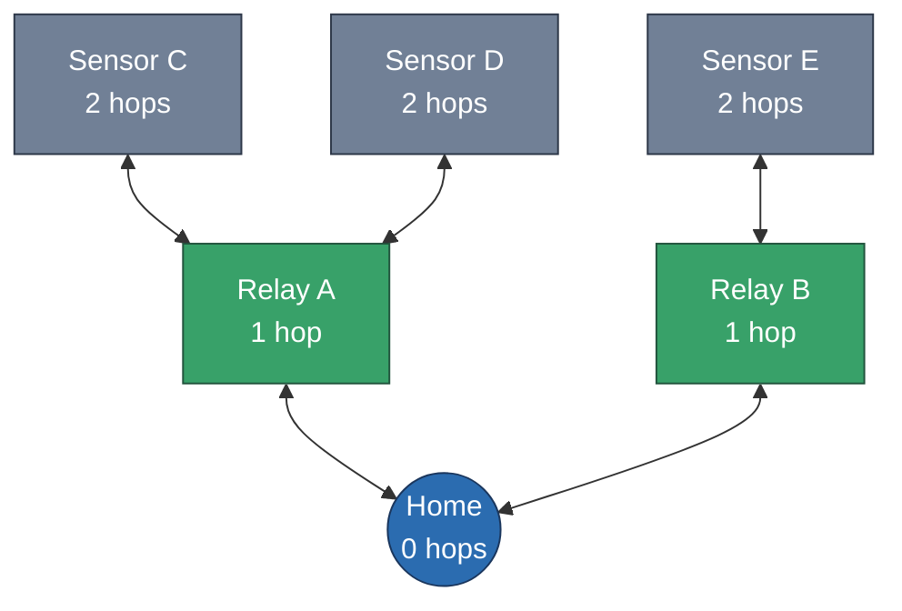

# Lighthouse Reckoning


[](https://doi.org/10.5281/zenodo.22033929)


**A LoRa mesh networking library for Arduino-family microcontrollers.**
One **Home** node collects application data from any number of
**Sensor/Relay** nodes spread across a multi-hop LoRa mesh — each node
discovers its own route to Home automatically, and every hop along the way
is individually confirmed and retried on failure.

| | |
|---|---|
| **Topology** | 1 Home node, *N* Sensor/Relay nodes |
| **Transport** | LoRa, via [RadioLib](https://github.com/jgromes/RadioLib) |
| **Delivery model** | Multi-hop, hop-by-hop confirmed |
| **DATA header overhead** | 16 bytes (23 bytes with optional AES-128-CCM encryption) |
| **License** | MIT |

## Contents

- [Why Lighthouse Reckoning?](#why-lighthouse-reckoning)
- [Features](#features)
- [Architecture](#architecture)
- [Supported Hardware](#supported-hardware)
- [Installation](#installation)
- [Quick Start](#quick-start)
- [Configuration](#configuration)
- [Documentation](#documentation)
- [Roadmap](#roadmap)
- [Security](#security)
- [Contributing](#contributing)
- [License](#license)
- [Citation](#citation)
- [Research Use](#research-use)
- [Author](#author)

## Why Lighthouse Reckoning?

The name derives from an old idea: a lighthouse does not look for
ships, it just stands there, motionless, so ships can find their way home.
That's basically the whole network at a glance. The **Home**
node is the lighthouse. It doesn't move, doesn't need to discover
anyone, it's simply the point every other device is trying to reach.
Everything else is a **vessel**. Most of them can't see the lighthouse
directly; they're out of range, blocked by something, or too far away.
They lean on the information from other vessels in the vicinity and get
relayed home hop by hop. In the same way a signal might get passed down a
coastline. Therefore, every node is both a vessel finding its own way *and*,
whenever it can, a navigational landmark by showing the distance to home.

**Reckoning** is the other half of it. It is the old navigational term for
working out where you are and which navigation decision should be made next,
using whatever information happens to be available right now. That's exactly
what the routing layer is doing under the hood: it constantly re-evaluates
the best path to Home as neighbors may come and go, signal strengths shift,
and hop counts change.

A single LoRa link is straightforward. Once several devices
communicate across multiple hops, a concept for routing, 
retries, and loop avoidance becomes inevitable.
Lighthouse Reckoning handles the routing and reliability
layer, reducing application programming to a few commands
like `sendData()`, `update()` and `onDataReceived()`

## Features

- Automatic multi-hop route to Home via periodic and reactive neighbor beacons
- Hop-by-hop confirmations instead of end-to-end ACKs. Each transmission is confirmed by the next hop, without requiring Home to maintain return paths to individual nodes.
- Non-blocking and interrupt-driven: one `update()` call per loop is enough, nothing blocks the radio
- Optional AES-128-CCM encryption and per-hop authentication, with a compact wire format
- Optional duty cycle budgeting depending on region regulations
- Compact wire format with a 2-byte minimum packet size and a 16-byte DATA header (23 bytes encrypted). The library has no dependencies beyond RadioLib.

## Architecture

Every node tracks its distance to Home in hops and advertises it to its
neighbors. Each node then picks whichever neighbor offers the shortest
resulting path as its own next hop — so data always moves one hop closer
to Home, without any node needing a full map of the network.



There's no end-to-end acknowledgment — Sensor C never learns whether its
packet reached Home. What it does know is that Relay A confirmed *that
specific hop*; Relay A separately learns whether Home confirmed the next
one. Reliability is built from that chain of independently confirmed hops,
not from tracking the packet's whole journey.

## Supported Hardware

Runs on any Arduino-compatible platform, tested on RP2040 and ESP32.
Channel Activity Detection and the single-DIO1-interrupt design have
been validated on the SX126x radio family (e.g. SX1262); other
RadioLib-supported radios are expected to work for basic send/receive, but
their CAD and interrupt behavior haven't been separately verified.

Optional encryption additionally requires a target with non-volatile
storage for the nonce counter — currently ESP32 and RP2040. It is compiled
out automatically on unsupported targets (e.g. classic AVR), which continue
to run unencrypted.

## Installation

1. Install [RadioLib](https://github.com/jgromes/RadioLib) (via the
   Arduino Library Manager or PlatformIO).
2. Clone or download this repository into your Arduino `libraries/` folder
   (or add it as a PlatformIO `lib_deps` entry pointing at this repo).
3. `#include <LighthouseReckoning.h>` alongside your RadioLib radio driver.

## Quick Start

Pin numbers below are placeholders for your board's actual wiring. This
is just enough to show the shape of the API — for complete, working
sketches see [`examples/`](examples), e.g.
[`examples/RP2040/BasicNode`](examples/RP2040/BasicNode) for a
Sensor/Relay node and [`examples/RP2040/HomeNode`](examples/RP2040/HomeNode)
for the Home node (ESP32 equivalents live under
[`examples/ESP32`](examples/ESP32)).

```cpp
#include <RadioLib.h>
#include <LighthouseReckoning.h>

#define PIN_CS    17
#define PIN_DIO1  20
#define PIN_RST   21
#define PIN_BUSY  22

SX1262 radio = new Module(PIN_CS, PIN_DIO1, PIN_RST, PIN_BUSY);
LighthouseReckoning lhr;

void onRadioIrq() { lhr.handleDio1Rise(); }

void setup() {
  radio.begin();
  // configure frequency, spreading factor, bandwidth, coding rate, and
  // power on `radio` to match your region's regulations

  lhr.beginAsNode(&radio, 0xA1B2C3D4);   // any Node ID except 0x00000000
  attachInterrupt(digitalPinToInterrupt(PIN_DIO1), onRadioIrq, RISING);
}

void loop() {
  lhr.update();   // call this on every loop iteration, it's non-blocking

  // sendData() should NOT be called every loop iteration — it would be
  // rejected with LHR_ERR_BUSY while a previous packet is still awaiting
  // confirmation. Send on your own interval instead:
  static unsigned long lastSendMs = 0;
  if (millis() - lastSendMs >= 60000) {   // e.g. once every 60s
    uint8_t payload[] = { 0x01, 0x02, 0x03 };
    lhr.sendData(payload, sizeof(payload));
    lastSendMs = millis();
  }
}
```

The Home node looks almost the same, just `beginAsHome()` instead of
`beginAsNode()`, plus an `onDataReceived()` callback to actually get the
incoming payloads — see
[`examples/RP2040/HomeNode`](examples/RP2040/HomeNode) for the full
version.

## Configuration

All optional — sensible defaults are used otherwise, so the examples
above work out of the box without touching any of this.

| Setting | Method | Default |
|---|---|---|
| TTL for outgoing DATA | `setTTL()` | 8 |
| Resend delay / RFCN wait | `setRetryDelays()` | 5000 ms / 5000 ms |
| Max retry cycles | `setMaxLocalRetries()` | 3 |
| Beacon interval | `setBeaconInterval()` | 60000 ms |
| TX watchdog timeout | `setTxWatchdogTimeout()` | 10000 ms |
| Duty cycle limiting | `toggleDutyCycleLimit()` / `setDutyCycleLimit()` | off; 1 % (EU868) when enabled |
| Encryption key | `setEncryptionKey()` | none set |
| Encryption enabled | `enableEncryption()` | off |

## Documentation

- **[docs/PROTOCOL.md](docs/PROTOCOL.md)** — the protocol specification:
  packet formats, routing, reliability, encryption, and timing, independent
  of this implementation.
- **[docs/PROTOCOL_REFERENCE.md](docs/PROTOCOL_REFERENCE.md)** — the same
  specification annotated with this library's constants, defaults, and
  full public API.
- **[CHANGELOG.md](CHANGELOG.md)** — release changes and known limitations.
- **[fieldtests/2026-08-09_forced-chain-test](fieldtests/2026-08-09_forced-chain-test)** —
  a real multi-hop field test with the raw radio log and the analysis
  behind it, if you want to see the routing behave under an actual
  forced 4-hop chain rather than just take the spec's word for it.

## Roadmap

See [Roadmap.md](Roadmap.md) for the planned development roadmap, including upcoming experimental features and future releases.

## Security

Optional AES-128-CCM encryption is available as of v1.1 (`setEncryptionKey()` /
`enableEncryption()`), providing per-hop confidentiality and authentication
using a single network-wide Pre-Shared Key. It is applied hop-by-hop rather
than end-to-end — every relay decrypts and re-encrypts each packet it
forwards — and it does **not** yet include replay protection: a captured,
validly-encrypted packet can currently be re-transmitted and will still pass
authentication. All devices on a network must be configured with the same
encryption setting and key; mismatched configuration causes packets to be
silently dropped rather than misinterpreted. See
[docs/PROTOCOL.md §9](docs/PROTOCOL.md#9-security-considerations) for the
full threat model, including what encryption does and does not protect
against. Running without encryption remains fully supported and unchanged
from v1.0.

## Contributing

Bug reports and feature requests are welcome. The templates in
[`.github/ISSUE_TEMPLATE`](.github/ISSUE_TEMPLATE) will guide you through
what's useful to include — hardware, radio configuration, logs, and so on
for bug reports.

## License

This project is licensed under the [MIT License](LICENSE).

## Citation

If you use Lighthouse Reckoning in academic or research work, please cite
it via its archived Zenodo record:

[https://doi.org/10.5281/zenodo.22033930](https://doi.org/10.5281/zenodo.22033930)

## Research Use

The Lower Saxony Ministry for Science and Culture (Germany) funds the "Central Laboratories for Digital Innovations in Lower Saxony" (Zentrallabore für Digitale Innovationen in Niedersachsen - ZDIN). Within the ZDIN, the Central Laboratory for Water employs the Lighthouse Reckoning protocol in the sub-project Adam4EvesWine (Ad-hoc Data Acquisition Mesh for Enhanced Versatile Explorations of Waters In Near-shore Extent).

## Author

Creator / Lead Developer: Fynn Jannis Schulz

Co-Design and field application setup: Jan Schulz