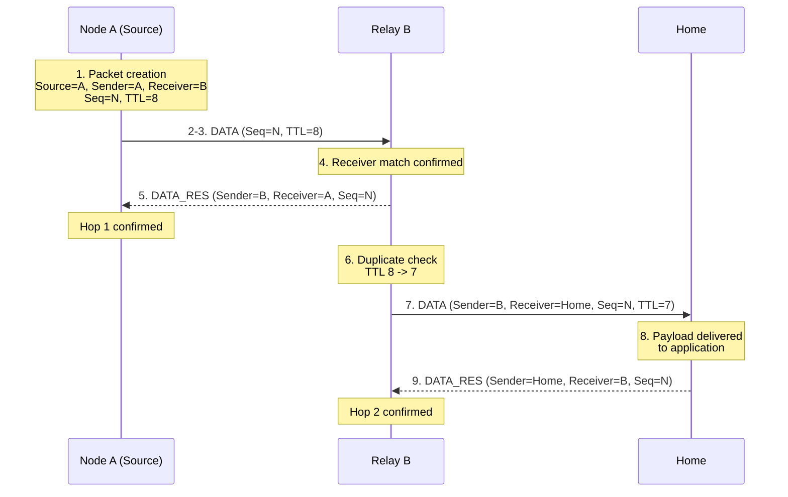

# Lighthouse Reckoning V1 Protocol Specification

*Wire protocol specification for the Lighthouse Reckoning LoRa mesh network.*

**Protocol Version:** V1.1 (packet format 1.1.0) — extends V1.0.0 with
an optional Encryption Mode (Section 2.10). The wire format used when
Encryption Mode is disabled is unchanged from 1.0.0.
**Status:** Stable packet format for both unencrypted (1.0.0) and
Encrypted (1.1.0) operation.

**Creator / Lead Developer:** Fynn Jannis Schulz

**Co-Designer**: Jan Schulz 

---

## Table of Contents

1. [Overview](#1-overview)
2. [Protocol Concepts](#2-protocol-concepts)
3. [Packet Format](#3-packet-format)
4. [Routing Algorithm](#4-routing-algorithm)
5. [DATA Transmission Flow](#5-data-transmission-flow)
6. [Reliability Mechanisms](#6-reliability-mechanisms)
7. [Failure Handling](#7-failure-handling)
8. [Timing Requirements](#8-timing-requirements)
9. [Security Considerations](#9-security-considerations)
10. [Compatibility and Versioning](#10-compatibility-and-versioning)
11. [Complete Packet Reference Tables](#11-complete-packet-reference-tables)

---

### Conventions Used in This Document

The key words **MUST**, **MUST NOT**, **SHOULD**, **SHOULD NOT**, and **MAY** are to be
interpreted as described in RFC 2119: MUST/MUST NOT indicate absolute
requirements or prohibitions; SHOULD/SHOULD NOT indicate a strong
recommendation from which deviation requires a good reason; MAY indicates a
truly optional element.

All byte offsets in this document are zero-indexed, counted from the first
byte of the packet. Field sizes are given in bytes. Multi-byte integer
fields use big-endian byte order (most significant byte first) unless
otherwise noted.

Where this specification cannot make a definitive statement because the
underlying protocol definitions do not resolve a question, the text says so
explicitly ("Not specified") rather than assuming a behavior.

This document describes the packet ("link") layer of Lighthouse Reckoning.
Physical-radio parameters such as carrier frequency, spreading factor (SF),
bandwidth (BW), and coding rate (CR) are configuration matters of the
underlying radio and are outside the scope of this specification. All
devices participating in the same network MUST be configured with compatible
physical-layer radio parameters, but this document does not mandate specific
values for them.

---

## 1. Overview

### 1.1 Purpose

Lighthouse Reckoning is a packet-based wireless mesh protocol built on top
of a LoRa radio physical layer. Its purpose is to deliver application data
from a number of distributed devices to a single collection point over
multiple wireless hops, while allowing each device to automatically
discover and maintain a path toward that collection point.

### 1.2 Network Model

The network consists of exactly one collection point, the **Home Node**,
and any number of other participating devices, referred to as **Nodes**.
All application data produced anywhere in the network is addressed, directly
or indirectly, to the Home Node. This is a single-sink network model: data
flows inward, from the edges of the mesh toward Home, rather than between
arbitrary pairs of devices.

### 1.3 Mesh Principle

Nodes that cannot reach the Home Node directly rely on other Nodes to
relay their data. Each Node that forwards a packet on behalf of another
device is acting as a relay for that transmission. A packet may therefore
travel across several independent radio transmissions ("hops") before it
reaches Home. The path a packet takes is not fixed in advance; it follows
whatever route each relaying Node currently believes is best, based on
locally available routing information (see [Section 4](#4-routing-algorithm)).

### 1.4 Node Roles

The protocol defines two roles:

| Role | Description |
|---|---|
| **Home Node** | The single, fixed collection point of the network. It is the ultimate destination of all application data. Home is always zero hops from itself. |
| **Node** | Any other participating device, informally a "Sensor/Relay" node. A Node may originate its own application data (acting as the data's **Source**) and/or forward data on behalf of other devices toward Home (acting as a **relay**). |

The protocol does not define a separate "Sensor" role distinct from Node at
the wire-protocol level. Whether a given transmission is an originating
transmission or a relayed one is a property of that specific packet (Source
ID vs. Sender ID — see [Section 3.1](#31-data)), not a separate class of
device. A single Node MAY simultaneously originate its own data and relay
data for other Nodes.

### 1.5 Multi-Hop Routing Concept

Routing in Lighthouse Reckoning is distance-vector based, using a hop count
as the sole distance metric. Every Node tracks how many hops it currently
believes it is from Home. Nodes advertise this value to their neighbors,
both periodically and reactively when it changes. A Node uses these
advertisements to pick a single neighbor as its own next hop toward Home —
namely, whichever neighbor offers the shortest resulting path, with signal
strength as a tiebreaker (see [Section 4](#4-routing-algorithm)).

### 1.6 Hop-by-Hop Confirmation Instead of End-to-End Acknowledgment

Lighthouse Reckoning does not provide end-to-end delivery confirmation.
There is no mechanism by which a Source Node learns that a packet it
originated has actually reached Home. Instead, reliability is provided
independently for each individual radio hop: whenever one Node transmits a
data packet directly to another, the receiving Node confirms that specific,
single transmission back to the sender — as soon as it determines the
transmission was addressed to it, before evaluating whether the payload
itself will be kept, relayed, or discarded (see
[Section 3.1](#31-data)). A multi-hop path is therefore only as reliable as
the concatenation of independently-confirmed single hops; the protocol
itself does not verify or guarantee that a chain of successful hops adds up
to the packet having reached Home.

---

## 2. Protocol Concepts

### 2.1 Node ID

A 32-bit unsigned integer that uniquely identifies a device on the network.
The value `0` is reserved and MUST NOT be assigned to a real device; it is
used within the protocol as a sentinel meaning "no valid node."

- **Set by:** the device itself, prior to participating in the network.
  How Node IDs are provisioned or guaranteed unique across a deployment is
  not specified.
- **Changed by:** not applicable — a Node ID is a fixed identity for a
  device's lifetime on the network.
- **Invalid when:** the value is `0`.

### 2.2 Home Node

The distinguished Node that acts as the network's single collection point.
A device operating as Home considers itself zero hops from Home. Home does
not itself relay DATA packets onward, as there is no further hop toward
itself to route to. Home does not process received NDAT advertisements —
it has no need for routing information of its own — but it does respond to
RFCN like any other Node, always advertising itself at zero hops.

### 2.3 Route to Home

The path information a Node maintains describing how to reach Home: which
directly-reachable neighbor to use as the next transmission target, and the
resulting hop count that route implies.

- **Set by:** the Node itself, based on [NDAT](#33-ndat) advertisements
  received from its neighbors.
- **Changed by:** re-evaluation whenever a new or updated advertisement is
  received that implies a better (shorter, or equal with stronger signal)
  route than the one currently in use, or whenever the currently-used
  neighbor is removed from the Node's neighbor information (see
  [Section 2.7](#27-neighbor-information)).
- **Invalid when:** no neighbor is currently known that offers a usable
  route (see **Hop Count** below). This is the case before any usable
  advertisement has been received, after every known neighbor offering a
  route has been removed, and immediately upon escalating to route recovery
  during the DATA retry cycle (see
  [Section 5](#5-data-transmission-flow)), which discards previously
  learned routing information before soliciting fresh advertisements.

### 2.4 Hop Count

A single-byte value representing how many hops a Node currently believes
it is from Home. Advertised in every [NDAT](#33-ndat) packet.

- `0` — reserved to mean the advertising device is Home itself.
- `255` — reserved to mean "no route" — the advertising device does not
  currently have a usable path to Home. A Node in this state MUST NOT be
  selected by its neighbors as a next hop, and SHOULD NOT advertise NDAT at
  all while in this state, since doing so provides no useful routing
  information.
- `1`–`254` — the number of relayed hops between the advertising device and
  Home, along its currently selected route.

- **Set by:** the advertising Node, based on its currently selected route:
  one greater than its selected next hop's own advertised Hop Count.
- **Changed by:** the Node itself, whenever its own best-known route to
  Home changes.
- **Invalid when:** the value is `255` ("no route"); any Node population of
  this field with `255` MUST be treated by receivers as "no usable route
  via this neighbor," not as a numeric hop distance. Because a Node's own
  Hop Count is derived by adding one to its selected next hop's advertised
  value, a next hop advertising `254` yields a resulting value of `255` —
  numerically indistinguishable from the "no route" sentinel. This
  specification does not define a resolution for this case beyond noting
  that it is a property of the one-byte Hop Count encoding.

### 2.5 TTL (Time to Live)

A single-byte field carried in every [DATA](#31-data) packet, limiting how
many times a given packet copy may be relayed.

- **Set by:** the originating Node, at the moment the packet is created.
  This specification does not mandate a specific starting value.
- **Changed by:** every relaying Node, subject to the rule below.
- **Invalid when:** the value received by a relaying Node is already `0`.

A relaying Node MUST inspect the TTL of every DATA packet addressed to it.
If the received TTL is greater than zero, the Node MUST decrement it by one
and MAY forward the packet using the decremented value — meaning a packet
whose TTL has just been decremented to `0` is still transmitted once more
by the Node performing that decrement. If the received TTL is already `0`,
the Node MUST NOT decrement it further and MUST NOT forward the packet; it
is discarded at that Node instead. TTL is the only mechanism by which a
packet's propagation is bounded; the protocol carries no separate,
time-based expiry for packets (see **Packet Lifetime** below).

### 2.6 Sequence Number

A single-byte field carried in both [DATA](#31-data) and
[DATA_RES](#32-data_res) packets. It correlates a specific outstanding DATA
transmission with the DATA_RES that confirms it, and contributes to
duplicate detection (see **Duplicate Detection** below and
[Section 6](#6-reliability-mechanisms)).

- **Set by:** the originating Node, at the moment a DATA packet is
  created, from a counter local to that Node.
- **Changed by:** not changed once set. A Sequence Number is assigned once,
  by the packet's originating Source, and MUST be preserved unchanged by
  every relaying Node as the packet travels toward Home — a relay forwards
  the same Sequence Number it received, together with the same Source ID.
- **Invalid when:** not applicable as a standalone condition; validity is
  evaluated jointly with the Receiver ID of a received DATA_RES (see
  [Section 3.2](#32-data_res)).

The one-byte range means a Node's Sequence Number counter wraps after 255
consecutively originated packets.

### 2.7 Neighbor Information

Every Node maintains information about other devices it has directly heard
from — its neighbors — including at minimum each neighbor's Node ID and
most recently advertised Hop Count.

- **Set by:** the receiving Node, upon receiving an [NDAT](#33-ndat)
  advertisement from a previously-unseen neighbor.
- **Changed by:** the receiving Node, upon receiving a subsequent NDAT from
  an already-known neighbor (refreshing that neighbor's advertised Hop
  Count and the time it was last heard from).
- **Invalid when:** a neighbor is removed after a bounded number of
  advertisement intervals pass without a fresh NDAT being heard from it.
  Neighbor storage also has a finite capacity; when full, a newly-heard
  neighbor MAY still be added by displacing the currently worst-known
  neighbor (the one with the greatest Hop Count, or weakest signal among
  neighbors tied on Hop Count), but only if the newly-heard neighbor is
  itself better by the same measure. A newly-heard neighbor that is not
  better than the current worst-known neighbor, when storage is full, is
  not added.

### 2.8 Packet Lifetime

Lighthouse Reckoning does not carry any timestamp or wall-clock expiry
field in any packet type. A packet's "lifetime" — the number of times it
may be forwarded — is governed exclusively by its TTL (see **TTL** above).

### 2.9 Duplicate Detection

Because a Node may retransmit a DATA packet it has not yet received
confirmation for (see [Section 6](#6-reliability-mechanisms)), the same
logical packet may arrive at a given receiver more than once. Receivers
recognize and discard packets they have already processed, rather than
treating a resend as a new, independent packet.

A received DATA packet is identified, for duplicate-detection purposes, by
the combination of its Source ID and Sequence Number. A receiving Node
keeps a bounded history of recently-seen (Source ID, Sequence Number)
pairs; the exact size of this history is an implementation parameter, not
fixed by this specification. Receiving a DATA_RES for a hop still occurs
even when the underlying DATA packet turns out to be a duplicate — see
[Section 3.1](#31-data).

### 2.10 Encryption Mode

A per-device configuration setting, independent of Node role, that
determines whether DATA, NDAT, RFCN, and DATA_RES packets are transmitted
and interpreted using their unencrypted form (Section 3.1-3.4) or their
Encrypted variant (Section 3.5). When enabled, a single 128-bit AES key —
the Pre-Shared Key (PSK) — is used by every device in the network for both
encrypting outgoing packets and decrypting/authenticating incoming ones.
There is no mechanism within the protocol for negotiating, distributing, or
verifying that all devices share the same Encryption Mode configuration or
PSK; this is an operational requirement on the deployment, not something
enforced by the wire protocol itself (see Section 9.3).

- **Set by:** the device operator, prior to the device joining the
  network. This specification does not define a runtime negotiation
  mechanism.
- **Changed by:** the device operator; changing this setting on a device
  already participating in a network with a different Encryption Mode
  configured results in that device being unable to interoperate with its
  neighbors (Section 10).
- **Invalid when:** not applicable — Encryption Mode is a binary
  configuration, not a value with defined/undefined states.

### 2.11 Nonce

An 8-byte value consisting of the encrypting Node ID and a Nonce Counter.
It MUST be unique for each encryption operation under a given PSK and
encrypting Node ID. It is used by AES-128-CCM to encrypt and authenticate
a single Encrypted-variant packet.

| Offset | Length | Field |
|---|---|---|
| 0 | 4 | Node ID of the encrypting device |
| 4 | 4 | Nonce Counter |

- **Node ID of the encrypting device** — the Node ID of whichever device
  performed this specific encryption operation. For a relayed DATA packet,
  this is the relay's own Node ID at the moment it re-encrypts the packet
  for the next hop (i.e., equal to that transmission's Sender ID field),
  not the packet's Source ID.
- **Nonce Counter** — a 32-bit unsigned integer, unique per encrypting
  device, that MUST increase by exactly one for every encryption operation
  that device performs, regardless of packet type (DATA, NDAT, RFCN, and
  DATA_RES share the same counter sequence on a given device — they are not
  counted separately). A device MUST persist this counter, or otherwise
  guarantee, across restarts, that no counter value already used with the
  current PSK is ever reused. The specific persistence mechanism (e.g.
  reserving values ahead of use in non-volatile storage) is an
  implementation matter, not fixed by this specification, provided the
  no-reuse guarantee holds.

**Wire representation.** Only the low 24 bits of the Nonce Counter (its
three least significant bytes) are transmitted, in the Wire Nonce Counter
field present in every Encrypted-variant packet (Section 3.5). The most
significant byte of the Nonce Counter is never transmitted and MUST be
reconstructed by the receiver by testing candidate values, starting from
0, against the MIC (Section 3.5) — this is the only means available to
recover a value that is not present on the wire.

A device's Nonce Counter High-Byte Search Bound is the number of
candidate values a receiver tests before discarding a packet as invalid
(see Nonce Counter exhaustion, below). This specification does not fix a
value for it, but — analogous to the PSK (Section 9.3) — every device
in the same network MUST be configured with an identical bound: a
receiver using a smaller bound than a sender's actual Nonce Counter
high-byte values would be unable to decrypt otherwise-valid traffic from
that sender. The search order among candidates is not significant to the
result and is left to the implementation.

Nonce Counter exhaustion. Once incrementing a device's Nonce Counter
would cause its most significant byte to exceed the network's configured
Nonce Counter High-Byte Search Bound, that device MUST NOT encrypt
further traffic using the current PSK. This specification does not
define recovery behavior beyond noting that continued operation requires
either a new PSK, a renegotiated bound, or some other mechanism outside
this specification's scope.

---

## 3. Packet Format

### 3.0 Common Framing

Every packet, regardless of type, begins with the same two fixed fields:

| Offset | Length | Field | Description |
|---|---|---|---|
| 0 | 1 | Magic | Fixed value `0xA4`. Marks the start of a packet. |
| 1 | 1 | Type | Identifies the packet type. See table below. |

**Packet type identifiers:**

| Type value | Packet |
|---|---|
| `0xE0` | DATA |
| `0xE1` | NDAT |
| `0xE2` | RFCN |
| `0xE3` | DATA_RES |

The minimum size of any structurally valid packet is 2 bytes (Magic +
Type). A received buffer shorter than this, or one whose first byte does
not match the Magic value, MUST NOT be interpreted as a Lighthouse
Reckoning packet and MUST be discarded without further processing.

No packet type defined in V1 carries an explicit length field for its own
total size, and no packet type carries a checksum or other integrity field
of its own; the total received length of a packet is expected to be
conveyed by the layer beneath this protocol (i.e. the radio's own reporting
of received packet length), not by a field within the packet itself. NDAT,
RFCN, and DATA_RES each have one fixed, exact total length; a received
packet of that type whose length does not exactly match MUST be discarded.
DATA has a fixed-length header followed by a variable-length payload; a
received DATA packet shorter than the fixed header length MUST be
discarded.

All multi-byte Node ID fields, wherever they appear in this section, use
big-endian byte order (most significant byte first).

---

### 3.1 DATA

**Purpose:** Carries application payload from its originating Node toward
Home, potentially across multiple relayed hops.

**Structure:** A fixed 16-byte header followed by a variable-length
application payload.

| Offset | Length | Field |
|---|---|---|
| 0 | 1 | Magic |
| 1 | 1 | Type (`0xE0`) |
| 2 | 4 | Source ID |
| 6 | 4 | Sender ID |
| 10 | 4 | Receiver ID |
| 14 | 1 | Sequence Number |
| 15 | 1 | TTL |
| 16 | variable | Payload |

**Field meanings:**

- **Source ID** — the Node ID of the device that originally created this
  application data. This value MUST remain unchanged for the entire
  lifetime of the packet, across every hop.
- **Sender ID** — the Node ID of whichever device is transmitting *this
  specific copy* of the packet, i.e. the immediately preceding hop from the
  receiver's point of view. Set to the originating Node's own ID at
  creation; updated to each relay's own ID whenever it forwards the packet.
- **Receiver ID** — the Node ID of the intended immediate next-hop
  recipient of *this specific transmission*. Set by whichever Node is
  currently transmitting, to the ID of the neighbor it has selected as its
  next hop toward Home (see [Section 4](#4-routing-algorithm)). Updated at
  every hop. A Node receiving a DATA packet whose Receiver ID does not
  match its own Node ID is not the intended recipient of that transmission
  and MUST silently discard it.
- **Sequence Number** — see [Section 2.6](#26-sequence-number).
- **TTL** — see [Section 2.5](#25-ttl-time-to-live).
- **Payload** — opaque application data. Its content is not interpreted by
  this protocol layer. Its length is implicitly the total received packet
  length minus the 16-byte fixed header; no explicit payload-length field
  is carried.

**Creation:** A Node originating new application data MUST populate Source
ID and Sender ID with its own Node ID, set Receiver ID to its currently
selected next hop toward Home, assign a new Sequence Number, and set an
initial TTL greater than zero. A Node MUST NOT have more than one
unconfirmed DATA transmission of its own outstanding at a time (see
[Section 6](#6-reliability-mechanisms)); this applies equally to
self-originated packets and to packets being relayed.

**Reception and forwarding behavior:** Upon receiving a structurally valid
DATA packet addressed to it (Receiver ID matches its own Node ID), a Node
MUST:

1. Transmit a [DATA_RES](#32-data_res) back to the Sender ID of the
   received packet, confirming this specific hop — before performing any
   of the steps below. This confirms only that the transmission was
   received; it does not imply the packet will be kept, relayed, or is
   even a new (non-duplicate) packet.
2. Determine whether the packet (identified by Source ID and Sequence
   Number) is a duplicate of one already processed. If so, discard it —
   no further action is taken.
3. If the Node is Home: deliver the payload to the application. Home does
   not forward DATA packets further.
4. If the Node is not Home: inspect and update the TTL per
   [Section 2.5](#25-ttl-time-to-live). If the packet is not discarded for
   TTL exhaustion, queue it for forwarding: update Sender ID to this
   Node's own ID, and select a Receiver ID for the outgoing transmission as
   follows — if this Node's currently selected next hop toward Home is not
   the same neighbor the packet was just received from, use that next hop;
   if it is the same neighbor, and an alternative next-hop candidate is
   known, that alternative SHOULD be used instead, to avoid immediately
   returning the packet to where it came from; if no alternative next-hop
   candidate is known, the packet MAY still be sent back to that same
   neighbor. Source ID and Sequence Number remain unchanged. The queued
   packet is then subject to the same transmission and retry behavior as a
   self-originated one (see [Section 5](#5-data-transmission-flow)).

A Node that already has an unconfirmed DATA transmission of its own
outstanding MUST NOT accept a newly-received DATA packet for processing;
such a packet is discarded on arrival (the sending Node's own retry
mechanism will result in it being retried later).

**Discard conditions:** A DATA packet is discarded, rather than kept or
forwarded, when any of the following is true:

- Its Receiver ID does not match the receiving Node's own Node ID.
- The receiving Node already has an unconfirmed DATA transmission of its
  own outstanding.
- It is recognized as a duplicate of one already processed.
- Its TTL, as received, is already `0`.
- The receiving Node (if not Home) has no valid next hop toward Home to
  forward it to.

---

### 3.2 DATA_RES

**Purpose:** Confirms that a single, specific radio transmission of a DATA
packet was received by its intended next-hop recipient. This is a
**hop-by-hop** acknowledgment, not an end-to-end delivery confirmation (see
[Section 1.6](#16-hop-by-hop-confirmation-instead-of-end-to-end-acknowledgment)).

**Structure:** Fixed length, 11 bytes total.

| Offset | Length | Field |
|---|---|---|
| 0 | 1 | Magic |
| 1 | 1 | Type (`0xE3`) |
| 2 | 4 | Sender ID |
| 6 | 4 | Receiver ID |
| 10 | 1 | Sequence Number |

**Field meanings:**

- **Sender ID** — the Node ID of the device issuing this acknowledgment,
  i.e. the Node that just received the DATA packet being confirmed.
- **Receiver ID** — the Node ID of the device this acknowledgment is
  directed to, i.e. the Node whose DATA transmission is being confirmed
  (the previous hop).
- **Sequence Number** — copied from the Sequence Number of the DATA packet
  being confirmed.

**Why this is not an end-to-end acknowledgment:** DATA_RES exists only
between two Nodes that directly exchanged a single radio transmission. It
carries no information about the packet's original Source or about how
many further hops, if any, remain before the packet reaches Home. A
successful chain of DATA_RES confirmations along a multi-hop path indicates
that each individual hop along that path succeeded independently; it does
not, by itself, constitute proof that the packet has reached Home.

**Acceptance rule:** A Node awaiting confirmation for an outstanding DATA
transmission treats a received DATA_RES as confirming that transmission
when both of the following hold:

- The DATA_RES's Receiver ID matches this Node's own Node ID, and
- The DATA_RES's Sequence Number matches the Sequence Number of the
  outstanding transmission.

A DATA_RES not addressed to this Node (Receiver ID does not match), or
received while no DATA transmission from this Node is currently
outstanding, is discarded without effect.

---

### 3.3 NDAT

**Purpose:** Neighbor advertisement. Broadcast by a Node to inform any
listening neighbors of its current distance, in hops, to Home. This is the
sole mechanism by which Nodes learn routes (see
[Section 4](#4-routing-algorithm)).

**Structure:** Fixed length, 7 bytes total.

| Offset | Length | Field |
|---|---|---|
| 0 | 1 | Magic |
| 1 | 1 | Type (`0xE1`) |
| 2 | 4 | Sender ID |
| 6 | 1 | Hops |

**Field meanings:**

- **Sender ID** — the Node ID of the device broadcasting this
  advertisement.
- **Hops** — see [Section 2.4](#24-hop-count). The advertising device's
  current distance, in hops, to Home.

**How neighbors learn routes from NDAT:** A Node receiving an NDAT records
or refreshes the advertising device as a neighbor, together with its
advertised Hop Count (see [Section 2.7](#27-neighbor-information)). The
receiving Node then evaluates whether using the advertiser as its next hop
— which would give it a resulting distance of the advertiser's Hops + 1 —
improves on its own current route. If so, it selects the advertiser as its
new next hop and updates its own advertised Hop Count accordingly. Home
does not process received NDAT (see [Section 2.2](#22-home-node)).

**When NDAT is sent:** NDAT is sent under three circumstances:

1. Periodically, as a broadcast beacon, whenever the sending Node
   currently has a route to Home. A Node with no current route SHOULD NOT
   send a periodic NDAT and SHOULD instead send an [RFCN](#34-rfcn) at that
   time.
2. In direct response to a received RFCN.
3. Reactively, shortly after the Node's own Hop Count changes, independent
   of the periodic schedule — subject to a minimum spacing between such
   reactive advertisements, to bound airtime usage if a route changes
   repeatedly in a short period. The specific minimum spacing is an
   implementation parameter, not fixed by this specification.

---

### 3.4 RFCN

**Purpose:** Solicits neighboring Nodes to (re-)broadcast their NDAT.
Used to discover or recover routing information.

**Structure:** Fixed length, 2 bytes total — Magic and Type only. RFCN
carries no Node ID or other identifying field.

| Offset | Length | Field |
|---|---|---|
| 0 | 1 | Magic |
| 1 | 1 | Type (`0xE2`) |

**Behavior on receipt:** A Node receiving an RFCN MUST respond by
broadcasting its own current [NDAT](#33-ndat), regardless of role — Home
responds to RFCN as well, always advertising itself at zero hops.
Except when the responding Node itself currently has no route to Home
(Hop Count = 255), in which case it SHOULD NOT respond.

**Response mechanism:** Because RFCN does not identify its originator, the
resulting NDAT response is a general broadcast, available to any listening
neighbor, rather than a unicast reply directed specifically back at whoever
sent the RFCN.

**When RFCN is sent:** A Node sends RFCN:

1. Upon first becoming operational, before any route to Home has been
   learned.
2. At its regular beacon interval, in place of NDAT, whenever it currently
   has no route to Home.
3. As part of escalated route recovery during the DATA transmission and
   retry cycle (see [Section 5](#5-data-transmission-flow)), after
   confirmation of an outstanding DATA transmission has not been received
   within the expected time. This escalation also discards the Node's
   currently known routing information, so that the resulting NDAT
   responses are evaluated afresh.

---

### 3.5 Encrypted Packet Variants

The following defines the wire layout used for DATA, NDAT, RFCN, and
DATA_RES when Encryption Mode (Section 2.10) is enabled, in place of the
layouts given in Sections 3.1-3.4. Packet Type values (Section 3.0) are
unchanged; Encryption Mode does not introduce new Type values, and a
device determines which layout to apply based solely on its own local
Encryption Mode configuration (Section 9.3), not on any field within the
packet.

Every Encrypted-variant packet carries three kinds of fields:

- **Additional Authenticated Data (AAD)** — transmitted in clear text, and
  included in the authentication computation: tampering with an AAD field
  is detected and causes authentication to fail. Consists of Magic, Type,
  and any Node ID fields a relaying device must read without decrypting
  the packet (Sender ID, and Receiver ID where present).
- **Ciphertext fields** — encrypted, and recoverable only by a device
  holding the Pre-Shared Key. Consists of whichever fields, from the
  unencrypted layout of the same packet type, are not needed by a relaying
  device prior to decryption (e.g. Source ID, Sequence Number, TTL, and
  Payload for DATA).
- **Wire Nonce Counter and MIC** — transmitted in clear text, neither
  encrypted nor included as AAD, but required to reconstruct the Nonce
  (Section 2.11) and verify authenticity respectively. Although the Wire
  Nonce Counter is not itself authenticated data, tampering with it causes
  the reconstructed nonce to be incorrect, which in turn causes MIC
  verification to fail — so tampering is still detected, indirectly.

A receiver MUST discard an Encrypted-variant packet for which MIC
verification does not succeed for any candidate Nonce Counter high byte
(Section 2.11), without further processing.

#### 3.5.1 DATA — Encrypted (`0xE0`)

**Structure:** A fixed 23-byte header followed by a variable-length
encrypted application payload.

| Offset | Length | Field | AAD / Ciphertext / Other |
|---|---|---|---|
| 0 | 1 | Magic | AAD |
| 1 | 1 | Type (`0xE0`) | AAD |
| 2 | 4 | Source ID | Ciphertext |
| 6 | 4 | Sender ID | AAD |
| 10 | 4 | Receiver ID | AAD |
| 14 | 1 | Sequence Number | Ciphertext |
| 15 | 1 | TTL | Ciphertext |
| 16 | 3 | Wire Nonce Counter | Other (see above) |
| 19 | 4 | MIC | Other (see above) |
| 23 | variable | Payload | Ciphertext |

Fixed header length: 23 bytes. All other behavior (creation, reception,
forwarding, discard conditions) is as specified in Section 3.1, applied to
the plaintext values of Source ID, Sequence Number, TTL, and Payload after
decryption — a relaying Node MUST fully decrypt a received DATA packet
before it can inspect or act on these fields, and MUST re-encrypt the
packet, under a freshly generated Nonce (Section 2.11) using its own Node
ID, before forwarding it.

#### 3.5.2 NDAT — Encrypted (`0xE1`)

**Structure:** Fixed length, 14 bytes total.

| Offset | Length | Field | AAD / Ciphertext / Other |
|---|---|---|---|
| 0 | 1 | Magic | AAD |
| 1 | 1 | Type (`0xE1`) | AAD |
| 2 | 4 | Sender ID | AAD |
| 6 | 1 | Hops | Ciphertext |
| 7 | 3 | Wire Nonce Counter | Other |
| 10 | 4 | MIC | Other |

Total fixed length: 14 bytes. All other behavior is as specified in
Section 3.3, applied to the plaintext Hops value after decryption.

#### 3.5.3 RFCN — Encrypted (`0xE2`)

**Structure:** Fixed length, 13 bytes total.

| Offset | Length | Field | AAD / Ciphertext / Other |
|---|---|---|---|
| 0 | 1 | Magic | AAD |
| 1 | 1 | Type (`0xE2`) | AAD |
| 2 | 4 | Sender ID | AAD |
| 6 | 3 | Wire Nonce Counter | Other |
| 9 | 4 | MIC | Other |

Total fixed length: 13 bytes. Unlike its unencrypted counterpart, the
Encrypted RFCN carries a Sender ID and is authenticated: a receiver MUST
verify the MIC before responding, and MUST NOT respond to an Encrypted
RFCN that fails verification. This closes the spoofing gap noted for
unencrypted RFCN in Section 9.2 — an attacker without the PSK cannot
produce an Encrypted RFCN that any device will accept and respond to. All
other behavior is as specified in Section 3.4.

#### 3.5.4 DATA_RES — Encrypted (`0xE3`)

**Structure:** Fixed length, 18 bytes total.

| Offset | Length | Field | AAD / Ciphertext / Other |
|---|---|---|---|
| 0 | 1 | Magic | AAD |
| 1 | 1 | Type (`0xE3`) | AAD |
| 2 | 4 | Sender ID | AAD |
| 6 | 4 | Receiver ID | AAD |
| 10 | 1 | Sequence Number | Ciphertext |
| 11 | 3 | Wire Nonce Counter | Other |
| 14 | 4 | MIC | Other |

Total fixed length: 18 bytes. All other behavior is as specified in
Section 3.2, applied to the plaintext Sequence Number after decryption.

---

## 4. Routing Algorithm

Routing in Lighthouse Reckoning is a distance-vector algorithm using hop
count as its primary metric, with signal strength as a secondary,
tie-breaking metric.

**Route formation:** A Node begins with no known route to Home. A route is
established exclusively through NDAT advertisements received from
neighbors; there is no other mechanism by which a Node learns a path to
Home.

**Next-hop selection:** Among all currently known neighbors that
themselves have a valid route to Home (Hop Count other than the "no route"
sentinel), a Node selects as its next hop whichever neighbor offers the
lowest resulting distance (that neighbor's Hop Count + 1). When more than
one known neighbor is tied on resulting distance, the neighbor with the
stronger received signal strength is selected. The selected next hop's
resulting distance becomes this Node's own advertised Hop Count.

**Multiple possible routes:** As described above, ties are resolved by
signal strength. A Node SHOULD also keep track of its next-best candidate
neighbor (by the same ordering), for use as an alternative next hop when
the primary selection is not usable for a particular transmission (see
[Section 3.1](#31-data)).

**No route available:** A Node that has not yet learned any route to Home
(Hop Count in the reserved "no route" state) has no next hop to address
outgoing DATA packets to, and cannot originate or forward DATA traffic
until a route is established. It SHOULD actively solicit routing
information via RFCN rather than relying solely on receiving unsolicited
NDAT (see [Section 3.4](#34-rfcn)).

---

## 5. DATA Transmission Flow

The following describes a representative two-hop delivery: Node A
originates data; Relay B forwards it; Home is the destination.

1. **Packet creation** — Node A creates a DATA packet: Source ID = A,
   Sender ID = A, Receiver ID = B (A's selected next hop), a new Sequence
   Number, and an initial TTL.
2. **Next-hop selection** — A addresses the packet to B because B is
   currently A's best-known route toward Home (see
   [Section 4](#4-routing-algorithm)).
3. **DATA transmission** — A transmits the DATA packet.
4. **Reception by relay** — B receives the packet, recognizes itself as
   the addressed Receiver, and immediately confirms this hop (step 5)
   before evaluating anything else.
5. **DATA_RES from B to A** — B transmits a DATA_RES back to A, confirming
   this specific hop. A, matching Receiver ID and Sequence Number against
   its outstanding transmission, marks this hop as confirmed.
6. **Duplicate check and TTL handling by B** — B checks whether it has
   already processed this (Source ID, Sequence Number) pair; if not, it
   decrements TTL per [Section 2.5](#25-ttl-time-to-live).
7. **Forwarding by B** — B updates Sender ID to itself and Receiver ID to
   its own selected next hop (Home, in this example), and queues the
   packet for transmission using the same mechanism described here,
   starting again from step 3 with B as sender.
8. **Arrival at Home** — Home receives the packet, confirms the hop, and
   delivers the payload to the application.
9. **DATA_RES from Home to B** — Home transmits a DATA_RES back to B,
   confirming the final hop.

**Retry behavior:** A Node that has transmitted a DATA packet and not yet
received a matching DATA_RES MUST, after a resend delay, retransmit the
same packet unchanged. If confirmation is still not received after a
further, equal delay (i.e. twice the resend delay from the original
transmission), the Node MUST escalate to route recovery: it discards its
currently known routing information and broadcasts an RFCN. After waiting
a further, separately configurable duration for NDAT responses, the whole
cycle — transmit, resend, escalate — restarts from the beginning, using
the freshly discovered routing information (if any). This repeats for a
bounded number of cycles; once exceeded, the packet is dropped.

| Time (relative to the start of one cycle) | Action |
|---|---|
| Cycle start | Packet (re-)transmitted; this counts as one retry cycle |
| + resend delay | If still unconfirmed: same packet retransmitted unchanged |
| + 2 × resend delay | If still unconfirmed: routing information discarded; RFCN broadcast |
| + 2 × resend delay + RFCN wait duration | Cycle ends; a new cycle begins from the start |

The resend delay, the RFCN wait duration, and the maximum number of cycles
are all implementation-configurable parameters, not fixed by this
specification (see [Section 8](#8-timing-requirements)).

**Timeout behavior:** The absence of a matching DATA_RES within the
expected window is the sole signal a sending Node has that a transmission
may have failed; the protocol provides no other failure notification for a
single hop.

**Route recovery:** RFCN, as described above, is the mechanism by which a
Node recovers routing information when confirmation is not being received,
as well as when it has no route at all.

---

## 6. Reliability Mechanisms

- **DATA_RES (hop-by-hop confirmation):** every single-hop DATA
  transmission is individually confirmed by its immediate recipient,
  before that recipient evaluates duplication, TTL, or forwarding. See
  [Section 3.2](#32-data_res).
- **Single outstanding transmission:** a Node does not have more than one
  unconfirmed DATA transmission of its own in flight at a time — neither a
  self-originated one nor one it is relaying. A newly-received DATA packet
  is not accepted while a prior one is still unconfirmed.
- **Retries:** a Node MUST retransmit a DATA packet for which it has not
  received a matching DATA_RES within the resend delay, up to a bounded
  number of full retry cycles. See [Section 5](#5-data-transmission-flow).
- **Duplicate protection:** receivers discard packets recognized as
  duplicates of ones already processed (by Source ID and Sequence Number),
  rather than reprocessing or re-relaying them — though the hop itself is
  still confirmed via DATA_RES regardless. See
  [Section 2.9](#29-duplicate-detection).
- **TTL:** bounds how many times any single packet may be relayed,
  preventing indefinite propagation. See [Section 2.5](#25-ttl-time-to-live).
- **Immediate-loop avoidance:** a relaying Node SHOULD NOT return a packet
  directly to the neighbor it was just received from when an alternative
  next hop is known, avoiding a trivial two-Node bounce. A loop spanning
  three or more Nodes is not directly prevented, but is bounded both by
  TTL and by duplicate detection, which discards the packet as soon as it
  revisits a Node that already processed it.
  See [Section 3.1](#31-data).
- **Route recovery:** RFCN allows a Node to solicit fresh NDAT
  advertisements from its neighbors when routing information needs to be
  (re-)established. See [Section 3.4](#34-rfcn).
- **Neighbor expiration:** a neighbor not heard from for a bounded number
  of advertisement intervals is removed from a Node's neighbor
  information. See [Section 2.7](#27-neighbor-information).

---

## 7. Failure Handling

| Condition | Specified behavior |
|---|---|
| **No next hop available** | The Node cannot forward or originate DATA traffic until a route is established (see [Section 4](#4-routing-algorithm)). |
| **DATA_RES lost** | The sending Node's resend delay expires without a matching DATA_RES; it retransmits, escalates to RFCN-based route recovery if still unconfirmed, and eventually discards the packet once the maximum number of retry cycles is exhausted (see [Section 5](#5-data-transmission-flow)). |
| **Relay unreachable** | Manifests identically to a lost DATA_RES from the sending Node's perspective — the same resend/escalate/drop sequence applies. |
| **Routing loop** | Directly returning a packet to the Node it was just received from is avoided when an alternative next hop is known (see [Section 6](#6-reliability-mechanisms)); a loop spanning three or more Nodes is not otherwise prevented, but is bounded both by TTL and by duplicate detection, which discards the packet once it revisits a Node that already processed it. |
| **TTL = 0** | A packet received with TTL already `0` MUST NOT be forwarded; it is discarded — after its hop is still confirmed via DATA_RES (see [Section 2.5](#25-ttl-time-to-live)). |
| **Duplicate packet** | Recognized via Source ID and Sequence Number and discarded rather than reprocessed or re-relayed. The hop is still confirmed via DATA_RES regardless (see [Section 2.9](#29-duplicate-detection)). |
| **Channel unavailable** | A Node senses the channel before transmitting; if activity is detected, the pending transmission is not sent at that time, and no dedicated backoff is scheduled beyond whatever transmission attempt (resend timer, next beacon) would already occur next. |

---

## 8. Timing Requirements

The protocol's definitions do not mandate fixed, universal timing values
for the behaviors below; the exact figures used by any given deployment are
operational parameters that MUST be consistent enough across the network
for retries and discovery to function usefully, but are not themselves part
of the wire format.

- **Beacon timing** — the interval at which a Node periodically broadcasts
  NDAT (or RFCN, if currently routeless). Not fixed by this specification.
- **Retry timing** — the resend delay, the RFCN wait duration, and the
  maximum number of retry cycles described in
  [Section 5](#5-data-transmission-flow). Not fixed by this specification.
- **Reactive-advertisement spacing** — the minimum interval enforced
  between reactive NDAT advertisements triggered by a Hop Count change
  (see [Section 3.3](#33-ndat)). Not fixed by this specification.
- **Duty cycle window** — transmissions are subject to a regulatory
  airtime budget tracked over a periodic one-hour window. This window
  resets in full once per window boundary, rather than continuously
  sliding. This window duration reflects common regional regulatory
  practice for the license-free bands LoRa operates in, rather than
  being a protocol-internal choice. The permitted percentage of
  airtime within that window is region-dependent and is not fixed by
  this specification; duty cycle limiting itself is also not
  mandatory for every deployment.
- **Channel sensing** — a Node MUST sense the channel for activity
  immediately before transmitting; if the channel is found busy, the
  transmission MUST NOT proceed at that time. This applies independently of
  packet type.

---

## 9. Security Considerations

### 9.1 Encryption Mode (Optional)

Lighthouse Reckoning defines an optional Encryption Mode (Section 2.10),
using AES-128 in CCM mode (Counter with CBC-MAC) with a 32-bit
authentication tag, and a single 128-bit Pre-Shared Key (PSK) shared
identically by every device in the network. When enabled, the Encrypted
variant of each packet type (Section 3.5) is used in place of the
corresponding packet type described in Sections 3.1-3.4.

Encryption Mode provides:
- **Confidentiality** for the fields marked as ciphertext in Section 3.5 for
  each packet type (e.g. Source ID, Sequence Number, TTL, and Payload for
  DATA), against any party without knowledge of the PSK.
- **Authenticity and integrity**, per hop, via the CCM authentication tag:
  a packet that was altered in transit, or was not produced by a holder of
  the PSK, fails MIC verification and MUST be discarded.

Encryption Mode does **not** provide:
- **End-to-end confidentiality or integrity.** Encryption is applied
  independently at each hop (Section 2.10), not from Source to Home. Every
  relaying Node decrypts each packet it forwards in full and re-encrypts it
  before transmitting further; the plaintext is therefore visible to every
  relay along the path, not only to Source and Home.
- **Protection against a compromised or malicious participant.** Because
  every device in the network shares the same PSK, any device holding it
  is equally capable of decrypting, forging, or injecting traffic of any
  type. Encryption Mode defends against parties outside the network, not
  against misbehavior by a participant already possessing the key.
- **Replay protection.** MIC verification confirms a packet was produced
  by a holder of the PSK and has not been altered; it does not confirm the
  packet is not a captured retransmission of previously valid traffic. A
  previously observed, validly-encrypted packet, replayed unmodified while
  the PSK remains unchanged, passes MIC verification identically to the
  original. The Duplicate Detection mechanism (Section 2.9) exists to
  handle the protocol's own retries and is not a defense against
  adversarial replay. Replay protection is anticipated in a later revision
  and is out of scope for this document.
- **Key distribution or rotation.** This specification does not define how
  the PSK is established, distributed, or rotated between devices; key
  provisioning is an out-of-band, deployment-specific concern.

### 9.2 Unencrypted Operation

When Encryption Mode is disabled, all considerations of the original V1.0.0
specification apply unchanged:

- **No encryption.** Node IDs, sequence numbers, hop counts, and
  application payload are all transmitted in clear text and are readable
  by any receiver within radio range.
- **No authentication.** Nothing prevents a transmitter from claiming an
  arbitrary Node ID, forging a DATA_RES, or injecting DATA, NDAT, or RFCN
  traffic.
- **No replay protection beyond duplicate detection**, for the same reason
  given in Section 9.1.

### 9.3 Mode Consistency Requirement

All devices participating in the same network MUST be configured with the
same Encryption Mode (enabled or disabled), the identical PSK, and the
identical Nonce Counter High-Byte Search Bound, when enabled.
There is no field in any packet that indicates which mode was used to
produce it; a device determines how to parse a received packet solely from
its own local configuration. Devices configured inconsistently do not
interoperate: see Section 10.

---

## 10. Compatibility and Versioning

**V1.1 packet format.** This document describes packet format version
1.1.0, which extends the V1.0.0 framing model described in Section 3.0-3.4
with an optional Encrypted variant of each packet type (Section 3.5). The
Magic byte, Type byte values, and unencrypted packet layouts are unchanged
from V1.0.0.

**Backward compatibility.** A network configured with Encryption Mode
disabled produces and expects wire traffic byte-for-byte identical to a
V1.0.0 deployment. A device predating the introduction of Encryption Mode
remains fully interoperable with 1.1.0 devices, provided Encryption Mode is
disabled network-wide.

**No mixed-mode operation.** Because there is no in-band signal
distinguishing an Encrypted-variant packet from its unencrypted counterpart
other than differing fixed/minimum length (Section 3.0), a device MUST NOT
be deployed into a network using the opposite Encryption Mode configuration
from its neighbors. Doing so results in every DATA/NDAT/RFCN/DATA_RES
packet exchanged between mismatched devices being discarded as
structurally invalid — via the length check in Section 3.0 — rather than
misinterpreted.

**Extensibility.** The Type field is one byte wide, of which V1.1 still
defines only four values, leaving room for additional packet types to be
introduced in future revisions without changing the framing model.

**Future direction.** Beyond this revision, later protocol revisions are
anticipated to add replay protection under Encryption Mode and to revise
the routing model. Any such changes are subject to their own, separate
specification and are not described further here.

---

## 11. Complete Packet Reference Tables

### 11.1 DATA (`0xE0`)

| Offset | Length | Field | Data Type | Byte Order | Description |
|---|---|---|---|---|---|
| 0 | 1 | Magic | 8-bit unsigned integer | N/A (1 byte) | Fixed value `0xA4`. |
| 1 | 1 | Type | 8-bit unsigned integer | N/A (1 byte) | Fixed value `0xE0`. |
| 2 | 4 | Source ID | 32-bit unsigned integer | Big-endian | Originating device's Node ID. Unchanged across all hops. |
| 6 | 4 | Sender ID | 32-bit unsigned integer | Big-endian | Node ID of the device transmitting this copy. Updated by each relay. |
| 10 | 4 | Receiver ID | 32-bit unsigned integer | Big-endian | Node ID of the intended immediate next-hop recipient. Updated by each relay. |
| 14 | 1 | Sequence Number | 8-bit unsigned integer | N/A (1 byte) | Assigned once by the Source; unchanged across all hops. |
| 15 | 1 | TTL | 8-bit unsigned integer | N/A (1 byte) | Remaining relay budget; decremented per hop. |
| 16 | variable | Payload | Octet string | N/A | Opaque application data. Length = total packet length − 16. |

Fixed header length: 16 bytes.

### 11.2 DATA_RES (`0xE3`)

| Offset | Length | Field | Data Type | Byte Order | Description |
|---|---|---|---|---|---|
| 0 | 1 | Magic | 8-bit unsigned integer | N/A (1 byte) | Fixed value `0xA4`. |
| 1 | 1 | Type | 8-bit unsigned integer | N/A (1 byte) | Fixed value `0xE3`. |
| 2 | 4 | Sender ID | 32-bit unsigned integer | Big-endian | Node ID of the device issuing this acknowledgment. |
| 6 | 4 | Receiver ID | 32-bit unsigned integer | Big-endian | Node ID of the device this acknowledgment is directed to. |
| 10 | 1 | Sequence Number | 8-bit unsigned integer | N/A (1 byte) | Copied from the DATA packet being confirmed. |

Total fixed length: 11 bytes.

### 11.3 NDAT (`0xE1`)

| Offset | Length | Field | Data Type | Byte Order | Description |
|---|---|---|---|---|---|
| 0 | 1 | Magic | 8-bit unsigned integer | N/A (1 byte) | Fixed value `0xA4`. |
| 1 | 1 | Type | 8-bit unsigned integer | N/A (1 byte) | Fixed value `0xE1`. |
| 2 | 4 | Sender ID | 32-bit unsigned integer | Big-endian | Node ID of the advertising device. |
| 6 | 1 | Hops | 8-bit unsigned integer | N/A (1 byte) | `0` = Home; `1`–`254` = hop distance to Home; `255` = no route. |

Total fixed length: 7 bytes.

### 11.4 RFCN (`0xE2`)

| Offset | Length | Field | Data Type | Byte Order | Description |
|---|---|---|---|---|---|
| 0 | 1 | Magic | 8-bit unsigned integer | N/A (1 byte) | Fixed value `0xA4`. |
| 1 | 1 | Type | 8-bit unsigned integer | N/A (1 byte) | Fixed value `0xE2`. |

Total fixed length: 2 bytes. Carries no other fields.

### 11.5 DATA — Encrypted (`0xE0`)

| Offset | Length | Field | Data Type | Byte Order | Description |
|---|---|---|---|---|---|
| 0 | 1 | Magic | 8-bit unsigned integer | N/A (1 byte) | Fixed value `0xA4`. |
| 1 | 1 | Type | 8-bit unsigned integer | N/A (1 byte) | Fixed value `0xE0`. |
| 2 | 4 | Source ID (ciphertext) | Octet string | N/A | AES-128-CCM ciphertext of the 32-bit Source ID. |
| 6 | 4 | Sender ID | 32-bit unsigned integer | Big-endian | Node ID of the device that produced this transmission's ciphertext. Also forms part of the AAD and the Nonce (Section 2.11). |
| 10 | 4 | Receiver ID | 32-bit unsigned integer | Big-endian | Node ID of the intended immediate next-hop recipient. Part of the AAD. |
| 14 | 1 | Sequence Number (ciphertext) | Octet string | N/A | AES-128-CCM ciphertext of the 8-bit Sequence Number. |
| 15 | 1 | TTL (ciphertext) | Octet string | N/A | AES-128-CCM ciphertext of the 8-bit TTL. |
| 16 | 3 | Wire Nonce Counter | 24-bit unsigned integer | Big-endian | Low 24 bits of the 32-bit Nonce Counter (Section 2.11). |
| 19 | 4 | MIC | Octet string | N/A | 32-bit AES-128-CCM authentication tag. |
| 23 | variable | Payload (ciphertext) | Octet string | N/A | AES-128-CCM ciphertext of the application payload. Length = total packet length − 23. |

Fixed header length: 23 bytes.

### 11.6 NDAT — Encrypted (`0xE1`)

| Offset | Length | Field | Data Type | Byte Order | Description |
|---|---|---|---|---|---|
| 0 | 1 | Magic | 8-bit unsigned integer | N/A (1 byte) | Fixed value `0xA4`. |
| 1 | 1 | Type | 8-bit unsigned integer | N/A (1 byte) | Fixed value `0xE1`. |
| 2 | 4 | Sender ID | 32-bit unsigned integer | Big-endian | Node ID of the advertising device. Part of the AAD and the Nonce. |
| 6 | 1 | Hops (ciphertext) | Octet string | N/A | AES-128-CCM ciphertext of the 8-bit Hops value. |
| 7 | 3 | Wire Nonce Counter | 24-bit unsigned integer | Big-endian | Low 24 bits of the 32-bit Nonce Counter (Section 2.11). |
| 10 | 4 | MIC | Octet string | N/A | 32-bit AES-128-CCM authentication tag. |

Total fixed length: 14 bytes.

### 11.7 RFCN — Encrypted (`0xE2`)

| Offset | Length | Field | Data Type | Byte Order | Description |
|---|---|---|---|---|---|
| 0 | 1 | Magic | 8-bit unsigned integer | N/A (1 byte) | Fixed value `0xA4`. |
| 1 | 1 | Type | 8-bit unsigned integer | N/A (1 byte) | Fixed value `0xE2`. |
| 2 | 4 | Sender ID | 32-bit unsigned integer | Big-endian | Node ID of the requesting device. Part of the AAD and the Nonce. |
| 6 | 3 | Wire Nonce Counter | 24-bit unsigned integer | Big-endian | Low 24 bits of the 32-bit Nonce Counter (Section 2.11). |
| 9 | 4 | MIC | Octet string | N/A | 32-bit AES-128-CCM authentication tag over the empty message. |

Total fixed length: 13 bytes. Carries no ciphertext field.

### 11.8 DATA_RES — Encrypted (`0xE3`)

| Offset | Length | Field | Data Type | Byte Order | Description |
|---|---|---|---|---|---|
| 0 | 1 | Magic | 8-bit unsigned integer | N/A (1 byte) | Fixed value `0xA4`. |
| 1 | 1 | Type | 8-bit unsigned integer | N/A (1 byte) | Fixed value `0xE3`. |
| 2 | 4 | Sender ID | 32-bit unsigned integer | Big-endian | Node ID of the device issuing this acknowledgment. Part of the AAD and the Nonce. |
| 6 | 4 | Receiver ID | 32-bit unsigned integer | Big-endian | Node ID this acknowledgment is directed to. Part of the AAD. |
| 10 | 1 | Sequence Number (ciphertext) | Octet string | N/A | AES-128-CCM ciphertext of the 8-bit Sequence Number. |
| 11 | 3 | Wire Nonce Counter | 24-bit unsigned integer | Big-endian | Low 24 bits of the 32-bit Nonce Counter (Section 2.11). |
| 14 | 4 | MIC | Octet string | N/A | 32-bit AES-128-CCM authentication tag. |

Total fixed length: 18 bytes.

### 11.9 Reserved / Sentinel Values

| Field | Value | Meaning |
|---|---|---|
| Node ID | `0x00000000` | Reserved. Never assigned to a real device. |
| Hops | `0` | The advertising device is Home. |
| Hops | `255` | No usable route to Home. MUST NOT be selected as a next hop. |