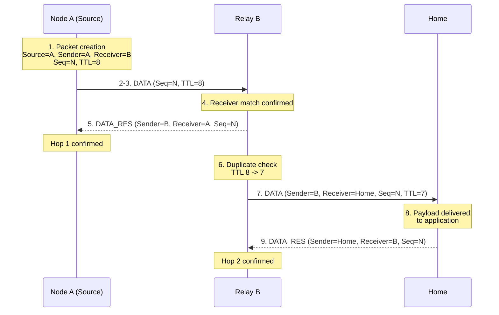

# Lighthouse Reckoning V1 Protocol Specification — Library Reference Edition

*Wire protocol specification for the Lighthouse Reckoning LoRa mesh network,
annotated with the corresponding reference implementation's constants,
types, default configuration values, and public API.*

**Protocol Version:** V1.1 (packet format 1.1.0)
**Status:** Stable packet format for both unencrypted (1.0.0) and Encrypted
(1.1.0) operation. Replay protection under Encryption Mode is not yet
specified (see [PROTOCOL.md](PROTOCOL.md) §9.1).

**Creator / Lead Developer:** Fynn Jannis Schulz

**Co-Designer**: Jan Schulz 

> This edition contains the same normative protocol specification as
> `PROTOCOL.md`, with added **Reference Implementation** notes (in
> blockquotes, like this one) that map each protocol concept to the exact
> constant, type, and method names used by the Lighthouse Reckoning
> reference library, plus full appendices listing every relevant constant
> and the complete public API. The blockquoted notes are informative, not
> normative — they describe one conforming implementation's choices, not
> requirements of the wire protocol itself. A compatible implementation in
> another language only has to satisfy the non-blockquoted specification
> text.

---

## Table of Contents

1. [Overview](#1-overview)
2. [Protocol Concepts](#2-protocol-concepts)
3. [Packet Format](#3-packet-format)
4. [Routing Algorithm](#4-routing-algorithm)
5. [DATA Transmission Flow](#5-data-transmission-flow)
6. [Reliability Mechanisms](#6-reliability-mechanisms)
7. [Failure Handling](#7-failure-handling)
8. [Timing Requirements](#8-timing-requirements)
9. [Security Considerations](#9-security-considerations)
10. [Compatibility and Versioning](#10-compatibility-and-versioning)
11. [Complete Packet Reference Tables](#11-complete-packet-reference-tables)
12. [Appendix A — Result and Error Code Reference](#12-appendix-a--result-and-error-code-reference)
13. [Appendix B — Default Configuration Values](#13-appendix-b--default-configuration-values)
14. [Appendix C — Reserved and Sentinel Value Symbols](#14-appendix-c--reserved-and-sentinel-value-symbols)
15. [Appendix D — Public API Reference](#15-appendix-d--public-api-reference)
16. [Appendix E — Testing and Debug Features](#16-appendix-e--testing-and-debug-features)
17. [Appendix F — Encryption Backend](#17-appendix-f--encryption-backend)

---

### Conventions Used in This Document

The key words **MUST**, **MUST NOT**, **SHOULD**, **SHOULD NOT**, and **MAY**
are to be interpreted as described in RFC 2119.

All byte offsets are zero-indexed from the first byte of the packet.
Multi-byte integer fields use big-endian byte order (most significant byte
first) unless otherwise noted.

Physical-radio parameters (frequency, spreading factor, bandwidth, coding
rate) are configuration matters of the underlying radio and are outside the
scope of this specification.

---

## 1. Overview

### 1.1 Purpose

Lighthouse Reckoning is a packet-based wireless mesh protocol built on top
of a LoRa radio physical layer. Its purpose is to deliver application data
from a number of distributed devices to a single collection point over
multiple wireless hops, while allowing each device to automatically
discover and maintain a path toward that collection point.

> **Reference implementation:** built on top of RadioLib, against any
> `PhysicalLayer`-compatible module (SX1262, SX1276, RFM95, etc.). Channel
> activity detection and the single-DIO1-interrupt design have been
> validated on the SX126x family specifically; other RadioLib-supported
> families are expected to work for basic TX/RX but their CAD and IRQ
> behavior have not been separately verified.

### 1.2 Network Model

The network consists of exactly one collection point, the **Home Node**,
and any number of other participating devices, referred to as **Nodes**.
All application data produced anywhere in the network is addressed, directly
or indirectly, to the Home Node. This is a single-sink network model: data
flows inward, from the edges of the mesh toward Home, rather than between
arbitrary pairs of devices.

### 1.3 Mesh Principle

Nodes that cannot reach the Home Node directly rely on other Nodes to
relay their data. Each Node that forwards a packet on behalf of another
device is acting as a relay for that transmission. A packet may therefore
travel across several independent radio transmissions ("hops") before it
reaches Home.

### 1.4 Node Roles

The protocol defines two roles:

| Role | Description |
|---|---|
| **Home Node** | The single, fixed collection point of the network. Home is always zero hops from itself. |
| **Node** | Any other participating device, informally a "Sensor/Relay" node. May originate its own application data and/or forward data for other devices toward Home. |

> **Reference implementation:** node role is tracked as a three-value type
> (`LHR_ROLE_NONE = 0`, `LHR_ROLE_HOME = 1`, `LHR_ROLE_NODE = 2`), where
> `LHR_ROLE_NONE` represents a device that has not yet called either setup
> method. The two setup methods are named `beginAsHome()` and
> `beginAsNode()`;

### 1.5 Multi-Hop Routing Concept

Routing in Lighthouse Reckoning is distance-vector based, using a hop count
as the sole distance metric, with signal strength as a tiebreaker.

### 1.6 Hop-by-Hop Confirmation Instead of End-to-End Acknowledgment

Lighthouse Reckoning does not provide end-to-end delivery confirmation.
Reliability is provided independently for each individual radio hop: the
receiving Node confirms a transmission back to its sender as soon as it
determines the transmission was addressed to it, before evaluating
duplication, TTL, or forwarding.

---

## 2. Protocol Concepts

### 2.1 Node ID

A 32-bit unsigned integer that uniquely identifies a device on the network.
The value `0` is reserved and MUST NOT be assigned to a real device.

> **Reference implementation:** the reserved value is defined as
> `LHR_FORBIDDEN_NODE_ID = 0x00000000`. Passing this value as `deviceId` to
> either setup method fails initialization with `LHR_INIT_ERR_INVALID_ARGS`.

### 2.2 Home Node

The distinguished Node that acts as the network's single collection point.
Home does not process received NDAT and does not forward DATA packets, but
does respond to RFCN like any other Node.

> **Reference implementation:** `beginAsHome()` sets the Hop Count to
> `LHR_HOPS_AS_HOME` (0) and immediately schedules an NDAT broadcast. NDAT
> reception is skipped entirely for a Home-role instance ("Home does not
> maintain a neighbor table").

### 2.3 Route to Home

The path information a Node maintains describing how to reach Home.

> **Reference implementation:** `beginAsNode()` sets the Hop Count to
> `LHR_HOPS_AS_RELAY_INIT` (equal to `LHR_HOPS_NO_ROUTE`, 255) and
> immediately broadcasts an RFCN. Escalated route recovery (see
> [Section 5](#5-data-transmission-flow)) clears the entire neighbor table,
> not just the currently-selected route.

### 2.4 Hop Count

A single-byte value representing how many hops a Node currently believes
it is from Home, advertised in every NDAT packet.

- `0` — the advertising device is Home.
- `255` — "no route." A Node in this state MUST NOT be selected as a next
  hop.
- `1`–`254` — hop distance to Home along the currently selected route.

> **Reference implementation:** these sentinels are defined as
> `LHR_HOPS_AS_HOME = 0` and `LHR_HOPS_NO_ROUTE = 255`. The public getter
> `getHopsToHome()` documents the same three-way range. A Node's own Hop
> Count is computed as `selected_neighbor.hops_to_home + 1`.

### 2.5 TTL (Time to Live)

A single-byte field carried in every DATA packet, limiting how many times a
given packet copy may be relayed. A relaying Node decrements a nonzero
received TTL and forwards using the decremented value; a packet already at
TTL `0` on receipt is discarded instead of decremented or forwarded.

> **Reference implementation:** newly originated DATA packets default to
> `LHR_DEFAULT_TTL = 8`, configurable via `setTTL()`. The receive-side
> check is `if (ttl > 0) { ttl--; /* continue */ } else { /* drop */ }`.

### 2.6 Sequence Number

A single-byte field in DATA and DATA_RES packets, assigned once by the
originating Node and left unchanged by every relay.

> **Reference implementation:** backed by a per-instance `uint8_t` counter
> (`_currentSeqNum`, starting at 0), post-incremented on every locally
> originated DATA packet. Relayed packets are forwarded via a raw copy of
> the received buffer, so the Sequence Number byte is never rewritten
> during relaying — only Sender ID and Receiver ID are.

### 2.7 Neighbor Information

Every Node maintains information about neighbors it has directly heard
from.

> **Reference implementation:** neighbor storage is a fixed-size array of
> up to `LHR_MAX_NEIGHBORS` entries (default 8; reduce via a project-level
> `#define` on memory-constrained targets). Each entry tracks Node ID, Hop
> Count, signal strength, and last-seen time. When full, a newly-heard
> neighbor displaces the current worst entry (highest Hop Count, then
> weakest signal) only if it is itself better by the same ordering;
> otherwise it is not added, surfaced as `LHR_ERR_FULL_NEIGHBORS`. A
> neighbor is pruned once it has gone unheard for
> `beaconInterval × LHR_NEIGHBOR_TIMEOUT_BEACONS` (default 3 missed
> beacons), checked once per beacon cycle, immediately before the periodic
> beacon is sent.

### 2.8 Packet Lifetime

No timestamp or wall-clock expiry field exists in any packet type. A
packet's lifetime is governed exclusively by TTL.

### 2.9 Duplicate Detection

A DATA packet is identified, for duplicate-detection purposes, by its
Source ID and Sequence Number.

> **Reference implementation:** a ring buffer of `LHR_SEEN_CACHE_SIZE`
> (default 8) most-recently-seen (Source ID, Sequence Number) pairs;
> entries are overwritten in circular order once full, described as
> "sufficient to cover typical retry bursts."

### 2.10 Encryption Mode

A per-device configuration setting determining whether packets use the
unencrypted (§3.1-3.4) or Encrypted (§3.5) wire layout. When enabled, all
devices share a single 128-bit AES Pre-Shared Key (PSK).

> **Reference implementation:** encryption support is gated at compile
> time by `LHR_ENCRYPTION_SUPPORTED` (1 on ESP32/RP2040 targets, which
> provide the non-volatile storage the Nonce Counter requires; 0 elsewhere,
> e.g. classic AVR — the entire encryption code path, including
> `setEncryptionKey()`/`enableEncryption()`/`isEncryptionEnabled()`, is
> compiled out on unsupported targets). The PSK is set via
> `setEncryptionKey(const uint8_t* key, size_t len)`, which requires
> exactly `LHR_AES_KEY_LEN` (16) bytes and only stores the key
> (`LHR_ERR_INVALID_KEY_LEN` otherwise) — it does not itself enable
> encryption. `enableEncryption(true)` activates it but fails with
> `LHR_ERR_NO_KEY_SET` if no key has been set yet; `enableEncryption(false)`
> always succeeds. Current state is queryable via `isEncryptionEnabled()`.

### 2.11 Nonce

An 8-byte value combining the encrypting device's Node ID and a per-device
monotonic counter, per `PROTOCOL.md` §2.11.

> **Reference implementation:** byte layout is `LHR_NONCE_LEN = 8`,
> `LHR_NONCE_OFFSET_DEVICEID = 0` (4 bytes), and
> `LHR_NONCE_OFFSET_NONCE_COUNTER = 4` (4 bytes). The Nonce Counter is a
> per-device `uint32_t` (`_encryptionNonceCounter`), shared across all four
> packet types — DATA, NDAT, RFCN, and DATA_RES draw from the same
> sequence, never a separate counter per type. It is persisted to
> non-volatile storage in batches of `LHR_NONCE_BATCH_SIZE` (100):
> `enableEncryption(true)` reserves the next 100 values by writing
> `counter + 100` to storage before any are used, and each time the in-RAM
> counter reaches the currently reserved boundary, a further 100 are
> reserved and written. This bounds flash wear to one write per 100
> packets, at the cost of skipping up to 100 counter values on an
> ungraceful restart. Storage backend is `Preferences`/NVS on ESP32 and an
> `EEPROM`-emulation on RP2040/Pico, both implemented in
> `LHR_EncryptionStore.cpp`.
>
> The Nonce Counter High-Byte Search Bound referenced in `PROTOCOL.md`
> §2.11 is fixed at compile time to
> `LHR_NONCE_UPPER_BYTE_MAX_ATTEMPTS = 10` (candidate values `0`–`9`), with
> no runtime setter — every device built from this library therefore
> agrees on the bound automatically; interoperating with a
> differently-configured implementation would require changing this
> constant and recompiling. `LHR_NONCE_COUNTER_MAX` is derived from it:
> `((LHR_NONCE_UPPER_BYTE_MAX_ATTEMPTS − 1) << 24) | 0x00FFFFFF`. Once the
> Nonce Counter would exceed this value, further encryption attempts fail
> with `LHR_ERR_NONCE_EXHAUSTED` (surfaced from `sendData()`,
> `_sendNDAT()`, `_sendRFCN()`, or `_sendDATARES()` as applicable) rather
> than transmitting.

---

## 3. Packet Format

### 3.0 Common Framing

| Offset | Length | Field | Description |
|---|---|---|---|
| 0 | 1 | Magic | Fixed value `0xA4`. Marks the start of a packet. |
| 1 | 1 | Type | Identifies the packet type. |

**Packet type identifiers:**

| Type value | Packet |
|---|---|
| `0xE0` | DATA |
| `0xE1` | NDAT |
| `0xE2` | RFCN |
| `0xE3` | DATA_RES |

Minimum structurally valid packet size: 2 bytes.

> **Reference implementation:** the magic byte is `LHR_START_BYTE = 0xA4`;
> the minimum size check uses `LHR_MIN_VALID_PACKET_SIZE = 2`. A received
> buffer failing the magic-byte check, or any per-type exact/minimum length
> check, is silently discarded — the radio is simply put back into receive
> mode, with no distinct error code raised for "malformed packet."
> When Encryption Mode is enabled, the minimum-size check instead uses
> `LHR_MIN_VALID_PACKET_SIZE_ENC = 13` (the smallest Encrypted-variant
> packet, RFCN) in place of `LHR_MIN_VALID_PACKET_SIZE`.

---

### 3.1 DATA

**Purpose:** Carries application payload from its originating Node toward
Home, potentially across multiple relayed hops.

| Offset | Length | Field |
|---|---|---|
| 0 | 1 | Magic |
| 1 | 1 | Type (`0xE0`) |
| 2 | 4 | Source ID |
| 6 | 4 | Sender ID |
| 10 | 4 | Receiver ID |
| 14 | 1 | Sequence Number |
| 15 | 1 | TTL |
| 16 | variable | Payload |

> **Reference implementation:** offsets are `LHR_DATA_OFFSET_MAGIC=0`,
> `LHR_DATA_OFFSET_TYPE=1`, `LHR_DATA_OFFSET_SOURCE=2`,
> `LHR_DATA_OFFSET_SENDER=6`, `LHR_DATA_OFFSET_RECEIVER=10`,
> `LHR_DATA_OFFSET_SEQ_NUM=14`, `LHR_DATA_OFFSET_TTL=15`,
> `LHR_DATA_OFFSET_PAYLOAD=16`. Header length
> `LHR_DATA_HEADER_LEN = LHR_DATA_OFFSET_PAYLOAD` (16); max payload
> `LHR_MAX_PAYLOAD = LORA_PHY_MAX_PACKET_SIZE - LHR_DATA_HEADER_LEN` (239
> bytes with the default 255-byte physical packet size ceiling). Queued
> outgoing data is not transmitted synchronously — `sendData()` only
> accepts the packet into a single-slot send queue; the actual radio
> transmission begins on the next call to the library's main processing
> function. Only one such queued/outstanding DATA transmission is allowed
> at a time (`LHR_ERR_BUSY` otherwise), and a newly-received DATA packet is
> dropped outright while one is outstanding, rather than queued for later.

**Field meanings, reception, and forwarding behavior:** as specified in
`PROTOCOL.md` §3.1 — unchanged here, since this behavior is part of the
normative wire protocol, not an implementation choice.

> **Reference implementation — acceptance check on DATA_RES:** the
> reference implementation matches a received DATA_RES against an
> outstanding transmission by checking that the DATA_RES's Receiver ID
> equals this Node's own Node ID, and that its Sequence Number equals the
> Sequence Number of the outstanding transmission (`_pendingAckSeqNum`).
> Sender ID is not part of the match.

---

### 3.2 DATA_RES

**Purpose:** Confirms a single, specific hop's transmission of a DATA
packet. Hop-by-hop, not end-to-end.

| Offset | Length | Field |
|---|---|---|
| 0 | 1 | Magic |
| 1 | 1 | Type (`0xE3`) |
| 2 | 4 | Sender ID |
| 6 | 4 | Receiver ID |
| 10 | 1 | Sequence Number |

> **Reference implementation:** offsets are `LHR_DATARES_OFFSET_MAGIC=0`,
> `LHR_DATARES_OFFSET_TYPE=1`, `LHR_DATARES_OFFSET_SENDER=2`,
> `LHR_DATARES_OFFSET_RECEIVER=6`, `LHR_DATARES_OFFSET_SEQ_NUM=10`; total
> length `LHR_DATA_RES_LEN = LHR_DATARES_OFFSET_SEQ_NUM + 1` (11 bytes). A
> DATA_RES is transmitted for every validly-addressed DATA reception,
> before any duplicate or TTL check — including for a packet that turns
> out to be a duplicate, or one that will be dropped for TTL exhaustion, so
> that a lost prior acknowledgment can still be resolved by the sender's
> retry. A confirmed match is surfaced as `LHR_UPDATE_TX_DATA_CONFIRMED`.

**Acceptance rule:** as specified in `PROTOCOL.md` §3.2 — Receiver ID and
Sequence Number.

---

### 3.3 NDAT

**Purpose:** Neighbor advertisement broadcasting a Node's current distance,
in hops, to Home.

| Offset | Length | Field |
|---|---|---|
| 0 | 1 | Magic |
| 1 | 1 | Type (`0xE1`) |
| 2 | 4 | Sender ID |
| 6 | 1 | Hops |

> **Reference implementation:** offsets are `LHR_NDAT_OFFSET_MAGIC=0`,
> `LHR_NDAT_OFFSET_TYPE=1`, `LHR_NDAT_OFFSET_SENDER=2`,
> `LHR_NDAT_OFFSET_HOPS=6`; total length
> `LHR_NDAT_LEN = LHR_NDAT_OFFSET_HOPS + 1` (7 bytes). The default periodic
> beacon interval is `LHR_DEFAULT_BEACON_INTERVAL_MS = 60000`, configurable
> via `setBeaconInterval()`. Reactive advertisements (triggered by a Hop
> Count change) are additionally rate-limited to at most once per 1000 ms
> (a fixed internal value with no corresponding public setter), and are
> further suppressed while a neighbor table is empty or while a DATA
> retry cycle is active, to avoid interfering with it. Transmission of a
> scheduled NDAT (periodic, reactive, or in reply to RFCN) is preceded by a
> random 0–500 ms jitter delay, to reduce collision probability when
> multiple neighbors respond to the same trigger simultaneously.

---

### 3.4 RFCN

**Purpose:** Solicits neighboring Nodes to (re-)broadcast their NDAT.

| Offset | Length | Field |
|---|---|---|
| 0 | 1 | Magic |
| 1 | 1 | Type (`0xE2`) |

> **Reference implementation:** offsets are `LHR_RFCN_OFFSET_MAGIC=0`,
> `LHR_RFCN_OFFSET_TYPE=1`; total length
> `LHR_RFCN_LEN = LHR_RFCN_OFFSET_TYPE + 1` (2 bytes). The default time a
> Node waits for NDAT replies after sending an RFCN is
> `LHR_DEFAULT_RFCN_WAIT_MS = 5000`, configurable via `setRetryDelays()`.
> RFCN is transmitted immediately, without the jitter delay used for NDAT,
> since it is a request rather than an advertisement that multiple Nodes
> might answer in unison. A Node that already has an NDAT response pending
> ignores a newly received RFCN rather than queuing a second response. The
> same applies, for a different reason, when the receiving Node has no
> current route to Home (`_hopsToHome == LHR_HOPS_NO_ROUTE`): no NDAT is
> transmitted in reply. `_handleRFCN()` still schedules the response
> unconditionally (subject only to the already-pending check above); the
> route check happens later, at the point of actual transmission in
> `update()`'s NDAT-jitter dispatch, which silently drops the send if the
> Node is still routeless once its jitter delay elapses.

**Behavior on receipt:** as specified in `PROTOCOL.md` §3.4 — normative,
unchanged.

---

### 3.5 Encrypted Packet Variants

As specified in `PROTOCOL.md` §3.5 — AAD/Ciphertext/Other field split,
per-hop decrypt-then-re-encrypt for DATA.

> **Reference implementation:** all four Encrypted-variant builders
> (`_buildEncryptedDataPacket`, `_buildEncryptedNDAT`, `_buildEncryptedRFCN`,
> `_buildEncryptedDATARES`) and verifiers (`_verifyAndDecryptDataPacket`,
> `_verifyAndDecryptNDAT`, `_verifyRFCN`, `_verifyAndDecryptDATARES`) live
> in `LHR_Routing.cpp` / `LHR_Rx.cpp` respectively, gated behind
> `#if LHR_ENCRYPTION_SUPPORTED`. AES-128-CCM itself (`_ccmEncrypt`/
> `_ccmDecrypt`) is a thin wrapper around `aes128_ccm_encrypt()`/
> `aes128_ccm_decrypt()`, implemented by a vendored third-party backend —
> see [Appendix F](#17-appendix-f--encryption-backend).
>
> A relayed DATA packet is fully decrypted (in `_handleDATA()`) before any
> TTL/duplicate/forwarding logic runs — reusing the same plaintext-layout
> code path as unencrypted DATA, by normalizing into a local buffer at the
> unencrypted offsets (§3.1) rather than duplicating that logic for the
> encrypted layout. On forwarding, `_forwardDataPacket()` always
> re-encrypts the packet into a separate transmission buffer with a fresh
> Nonce Counter value, never reusing ciphertext bytes from the received
> packet — this is deliberate: a resend by the local retry mechanism (§5)
> MUST use a distinct Nonce from the original transmission.

#### 3.5.1 DATA — Encrypted (`0xE0`)

**Purpose:** As §3.1, with confidentiality and authenticity added per
`PROTOCOL.md` §3.5.1.

| Offset | Length | Field |
|---|---|---|
| 0 | 1 | Magic |
| 1 | 1 | Type (`0xE0`) |
| 2 | 4 | Source ID (ciphertext) |
| 6 | 4 | Sender ID |
| 10 | 4 | Receiver ID |
| 14 | 1 | Sequence Number (ciphertext) |
| 15 | 1 | TTL (ciphertext) |
| 16 | 3 | Wire Nonce Counter |
| 19 | 4 | MIC |
| 23 | variable | Payload (ciphertext) |

> **Reference implementation:** offsets are `LHR_DATA_ENC_OFFSET_MAGIC=0`,
> `LHR_DATA_ENC_OFFSET_TYPE=1`, `LHR_DATA_ENC_OFFSET_SOURCE=2`,
> `LHR_DATA_ENC_OFFSET_SENDER=6`, `LHR_DATA_ENC_OFFSET_RECEIVER=10`,
> `LHR_DATA_ENC_OFFSET_SEQ_NUM=14`, `LHR_DATA_ENC_OFFSET_TTL=15`,
> `LHR_DATA_ENC_OFFSET_WIRECOUNTER=16`, `LHR_DATA_ENC_OFFSET_MIC=19`,
> `LHR_DATA_ENC_OFFSET_PAYLOAD=23`. Fixed header length
> `LHR_DATA_HEADER_ENC_LEN = LHR_DATA_ENC_OFFSET_PAYLOAD` (23); max payload
> `LHR_MAX_PAYLOAD_ENC = LORA_PHY_MAX_PACKET_SIZE - LHR_DATA_HEADER_ENC_LEN`
> (232 bytes with the default 255-byte ceiling — 7 bytes less than the
> unencrypted `LHR_MAX_PAYLOAD`, the overhead of the Wire Nonce Counter and
> MIC). The plaintext block assembled for encryption is
> `LHR_DATA_ENC_HEADER_FIELDS_LEN` (6: Source ID + Sequence Number + TTL)
> followed by the payload; AAD is Magic, Type, Sender ID, Receiver ID (10
> bytes).

#### 3.5.2 NDAT — Encrypted (`0xE1`)

**Purpose:** As §3.3, with confidentiality and authenticity added per
`PROTOCOL.md` §3.5.2.

| Offset | Length | Field |
|---|---|---|
| 0 | 1 | Magic |
| 1 | 1 | Type (`0xE1`) |
| 2 | 4 | Sender ID |
| 6 | 1 | Hops (ciphertext) |
| 7 | 3 | Wire Nonce Counter |
| 10 | 4 | MIC |

> **Reference implementation:** offsets are `LHR_NDAT_ENC_OFFSET_MAGIC=0`,
> `LHR_NDAT_ENC_OFFSET_TYPE=1`, `LHR_NDAT_ENC_OFFSET_SENDER=2`,
> `LHR_NDAT_ENC_OFFSET_HOPS=6`, `LHR_NDAT_ENC_OFFSET_WIRECOUNTER=7`,
> `LHR_NDAT_ENC_OFFSET_MIC=10`; total length
> `LHR_NDAT_ENC_LEN = LHR_NDAT_ENC_OFFSET_MIC + LHR_MIC_LEN` (14).

#### 3.5.3 RFCN — Encrypted (`0xE2`)

**Purpose:** As §3.4, with authenticity added per `PROTOCOL.md` §3.5.3 —
unlike unencrypted RFCN, this variant carries a Sender ID and is
authenticated before any NDAT response is sent.

| Offset | Length | Field |
|---|---|---|
| 0 | 1 | Magic |
| 1 | 1 | Type (`0xE2`) |
| 2 | 4 | Sender ID |
| 6 | 3 | Wire Nonce Counter |
| 9 | 4 | MIC |

> **Reference implementation:** offsets are `LHR_RFCN_ENC_OFFSET_MAGIC=0`,
> `LHR_RFCN_ENC_OFFSET_TYPE=1`, `LHR_RFCN_ENC_OFFSET_SENDER=2`,
> `LHR_RFCN_ENC_OFFSET_WIRECOUNTER=6`, `LHR_RFCN_ENC_OFFSET_MIC=9`; total
> length `LHR_RFCN_ENC_LEN = LHR_RFCN_ENC_OFFSET_MIC + LHR_MIC_LEN` (13).
> `_verifyRFCN()` is called from `_handleRFCN()` before scheduling any NDAT
> response; a failed verification is logged and the packet is otherwise
> ignored — no response is sent.

#### 3.5.4 DATA_RES — Encrypted (`0xE3`)

**Purpose:** As §3.2, with confidentiality and authenticity added per
`PROTOCOL.md` §3.5.4.

| Offset | Length | Field |
|---|---|---|
| 0 | 1 | Magic |
| 1 | 1 | Type (`0xE3`) |
| 2 | 4 | Sender ID |
| 6 | 4 | Receiver ID |
| 10 | 1 | Sequence Number (ciphertext) |
| 11 | 3 | Wire Nonce Counter |
| 14 | 4 | MIC |

> **Reference implementation:** offsets are
> `LHR_DATARES_ENC_OFFSET_MAGIC=0`, `LHR_DATARES_ENC_OFFSET_TYPE=1`,
> `LHR_DATARES_ENC_OFFSET_SENDER=2`, `LHR_DATARES_ENC_OFFSET_RECEIVER=6`,
> `LHR_DATARES_ENC_OFFSET_SEQ_NUM=10`,
> `LHR_DATARES_ENC_OFFSET_WIRECOUNTER=11`,
> `LHR_DATARES_ENC_OFFSET_MIC=14`; total length
> `LHR_DATARES_ENC_LEN = LHR_DATARES_ENC_OFFSET_MIC + LHR_MIC_LEN` (18).
> Receiver ID is read directly from the wire (it is AAD, not ciphertext)
> to cheaply reject a DATA_RES not addressed to this Node before
> attempting decryption.

---

## 4. Routing Algorithm

Routing in Lighthouse Reckoning is a distance-vector algorithm using hop
count as its primary metric, with signal strength as a tiebreaker, as
specified in `PROTOCOL.md` §4.

> **Reference implementation:** best and second-best neighbor are
> recomputed in a single pass after every neighbor-table change (new
> neighbor, refreshed neighbor, eviction, or pruning). Ordering: lower Hop
> Count wins; when tied, higher (stronger) RSSI wins. The second-best
> candidate falls back to the best candidate's own ID when only one usable
> neighbor is known, so that loop-avoidance logic (see
> [Section 5](#5-data-transmission-flow)) always has a usable fallback
> value even without a genuine second neighbor.

---

## 5. DATA Transmission Flow

1. **Packet creation** — Source ID = Sender ID = originating Node; Receiver
   ID = selected next hop; new Sequence Number; initial TTL.
2. **Next-hop selection** — per [Section 4](#4-routing-algorithm).
3. **DATA transmission.**
4. **Reception by relay** — DATA_RES sent immediately.
5. **DATA_RES from relay to sender** — confirms this hop.
6. **Duplicate check and TTL handling.**
7. **Forwarding** — Sender/Receiver updated; retransmitted.
8. **Arrival at Home** — payload delivered to the application.
9. **DATA_RES from Home to last relay** — confirms the final hop.



**Retry, timeout, and route recovery:** as specified in `PROTOCOL.md` §5.

> **Reference implementation:** default resend delay
> `LHR_DEFAULT_RESEND_DELAY_MS = 5000`; default RFCN wait
> `LHR_DEFAULT_RFCN_WAIT_MS = 5000`; default max retry cycles
> `LHR_DEFAULT_MAX_LOCAL_RETRIES = 3`. With defaults, one full cycle
> (transmit → resend at 5 s → escalate to RFCN at 10 s → cycle reset at
> 15 s) takes about 15 seconds; a packet is dropped after 3 such cycles —
> roughly 45 seconds by default, across up to 6 physical DATA transmissions
> and 3 RFCN broadcasts. A resend is surfaced as `LHR_UPDATE_TX_RESEND`;
> a confirmed hop as `LHR_UPDATE_TX_DATA_CONFIRMED`; exhausting all cycles
> as `LHR_UPDATE_TX_DATA_FAILED`. The processing function
> (`update()`) documents its own per-call priority order as: (1) in-flight
> transmit completion/watchdog, (2) incoming packet dispatch, (3) the DATA_RES retry/confirmation state machine, (4) any due NDAT jitter
> transmission, (5) the periodic beacon — periodic and reactive beacons are
> skipped for a call in which step (3) is active, so an outstanding DATA
> confirmation is not interrupted by routine advertisement traffic. A
> beacon already due at the start of a call remains due and is
> re-evaluated on the next call once step (3) is no longer active, rather
> than being silently dropped.

---

## 6. Reliability Mechanisms

As specified in `PROTOCOL.md` §6.

> **Reference implementation:** each of these mechanisms is externally
> observable through a single status enumeration returned after each
> internal processing step, including (among others) `LHR_UPDATE_RX_DATA`,
> `LHR_UPDATE_RX_DATARES`, `LHR_UPDATE_TX_RESEND`,
> `LHR_UPDATE_TX_DATA_CONFIRMED`, and `LHR_UPDATE_TX_DATA_FAILED`. The full
> enumeration is listed in
> [Appendix A](#12-appendix-a--result-and-error-code-reference). The
> "single outstanding transmission" rule is surfaced as `LHR_ERR_BUSY` when
> a new send is attempted, and as an outright drop (no distinct code) for a
> newly-received DATA packet arriving while busy.

---

## 7. Failure Handling

As specified in `PROTOCOL.md` §7.

> **Reference implementation:** several of these conditions are surfaced
> directly as distinct result codes: `LHR_ERR_NO_ROUTE` (no neighbor known
> yet), `LHR_ERR_BUSY` (a DATA_RES is already outstanding), `LHR_ERR_ZERO_TTL`
> (TTL is zero, can't send), `LHR_ERR_FULL_NEIGHBORS`,
> `LHR_ERR_DUTY_CYCLE_EXHAUSTED`, and, at the radio-transmission level,
> `LHR_TX_CHANNEL_BUSY` (channel activity detected before transmit, via
> Channel Activity Detection / CAD) and `LHR_TX_DUTY_CYCLE`. A channel-busy
> transmit attempt is abandoned for that attempt with no dedicated
> backoff — the comment in the source notes "existing retry timers will
> naturally try again later." See
> [Appendix A](#12-appendix-a--result-and-error-code-reference) for the
> full list.

---

## 8. Timing Requirements

As specified in `PROTOCOL.md` §8, no timing value is mandated by the wire
protocol itself.

> **Reference implementation default values:**
>
> | Parameter | Default | Constant / source |
> |---|---|---|
> | Beacon interval | 60,000 ms | `LHR_DEFAULT_BEACON_INTERVAL_MS`, via `setBeaconInterval()` |
> | Resend delay | 5,000 ms | `LHR_DEFAULT_RESEND_DELAY_MS`, via `setRetryDelays()` |
> | RFCN reply wait | 5,000 ms | `LHR_DEFAULT_RFCN_WAIT_MS`, via `setRetryDelays()` |
> | Max local retries | 3 | `LHR_DEFAULT_MAX_LOCAL_RETRIES`, via `setMaxLocalRetries()` |
> | Reactive-advertisement spacing | 1,000 ms | fixed internal value, no public setter |
> | Neighbor staleness | 3 missed beacons | `LHR_NEIGHBOR_TIMEOUT_BEACONS`, no public setter |
> | TX watchdog | 10,000 ms | fixed default, via `setTxWatchdogTimeout()` |
> | Duty cycle window | 3,600,000 ms (1 h) | `LHR_DUTY_CYCLE_WINDOW_MS` |
> | Duty cycle budget | 1.0 % (EU868 g1), disabled by default | `LHR_DEFAULT_DUTY_CYCLE_PERCENT`, via `toggleDutyCycleLimit()` / `setDutyCycleLimit()` |
> | NDAT jitter | random 0–500 ms | fixed range, not separately configurable |
>
> Duty cycle limiting itself is off by default and must be explicitly
> enabled. The duty-cycle window is a simple periodic reset (usage returns
> to zero once per window boundary) rather than a continuously sliding
> window. The window duration is described as regulatory in nature; the
> percentage is explicitly EU868-specific and intended to be reconfigured
> for other regions (e.g. US915, AU915).

---

## 9. Security Considerations

As specified in `PROTOCOL.md` §9.1-9.3 (unencrypted: no encryption, no
authentication, no replay protection beyond duplicate detection;
Encrypted: AES-128-CCM confidentiality/authenticity per hop, shared-PSK
network-wide, hop-by-hop not end-to-end, no replay protection, no key
distribution/rotation mechanism).

> **Reference implementation:** the AES-128-CCM backend is a vendored,
> unmodified third-party implementation — see
> [Appendix F](#17-appendix-f--encryption-backend). No key-distribution,
> key-rotation, or secure-storage mechanism for the PSK is provided;
> `setEncryptionKey()` copies the key as given into RAM
> (`_encryptionKey`), with no protection beyond whatever the host MCU
> itself provides against physical extraction. The reference examples
> (`examples/*/*.ino`) hardcode an illustrative test key and call
> `setEncryptionKey()` unconditionally but leave `enableEncryption(true)`
> commented out by default, so a fresh checkout of any example runs
> unencrypted until a user explicitly opts in — and, per `PROTOCOL.md`
> §9.3/§10, must do so identically and with the identical key on every
> device in the network.

---

## 10. Compatibility and Versioning

As specified in PROTOCOL.md §10 (packet format 1.1.0 extends 1.0.0 with optional Encryption Mode; unencrypted wire traffic is byte-identical to 1.0.0; no mixed-mode operation).

> **Reference implementation:** library version is tracked separately from
> the packet format version, via `LHR_VERSION_MAJOR`/`MINOR`/`PATCH`
> (currently 1.1.0) and exposed at runtime through `library_version()` and
> `getVersionString()`. An experimental per-hop metadata extension exists
> alongside the stable packet formats — see
> [Appendix E](#16-appendix-e--testing-and-debug-features).

---

## 11. Complete Packet Reference Tables

### 11.1 DATA (`0xE0`)

| Offset | Length | Field | Data Type | Byte Order | Description |
|---|---|---|---|---|---|
| 0 | 1 | Magic | 8-bit unsigned integer | N/A (1 byte) | Fixed value `0xA4`. |
| 1 | 1 | Type | 8-bit unsigned integer | N/A (1 byte) | Fixed value `0xE0`. |
| 2 | 4 | Source ID | 32-bit unsigned integer | Big-endian | Originating device's Node ID. Unchanged across all hops. |
| 6 | 4 | Sender ID | 32-bit unsigned integer | Big-endian | Node ID of the device transmitting this copy. Updated by each relay. |
| 10 | 4 | Receiver ID | 32-bit unsigned integer | Big-endian | Node ID of the intended immediate next-hop recipient. Updated by each relay. |
| 14 | 1 | Sequence Number | 8-bit unsigned integer | N/A (1 byte) | Assigned once by the Source; unchanged across all hops. |
| 15 | 1 | TTL | 8-bit unsigned integer | N/A (1 byte) | Remaining relay budget; decremented per hop. |
| 16 | variable | Payload | Octet string | N/A | Opaque application data. Length = total packet length − 16. |

Fixed header length: 16 bytes. Default max payload: 239 bytes (255-byte
default PHY ceiling − 16-byte header).

### 11.2 DATA_RES (`0xE3`)

| Offset | Length | Field | Data Type | Byte Order | Description |
|---|---|---|---|---|---|
| 0 | 1 | Magic | 8-bit unsigned integer | N/A (1 byte) | Fixed value `0xA4`. |
| 1 | 1 | Type | 8-bit unsigned integer | N/A (1 byte) | Fixed value `0xE3`. |
| 2 | 4 | Sender ID | 32-bit unsigned integer | Big-endian | Node ID of the device issuing this acknowledgment. |
| 6 | 4 | Receiver ID | 32-bit unsigned integer | Big-endian | Node ID of the device this acknowledgment is directed to. |
| 10 | 1 | Sequence Number | 8-bit unsigned integer | N/A (1 byte) | Copied from the DATA packet being confirmed. |

Total fixed length: 11 bytes.

### 11.3 NDAT (`0xE1`)

| Offset | Length | Field | Data Type | Byte Order | Description |
|---|---|---|---|---|---|
| 0 | 1 | Magic | 8-bit unsigned integer | N/A (1 byte) | Fixed value `0xA4`. |
| 1 | 1 | Type | 8-bit unsigned integer | N/A (1 byte) | Fixed value `0xE1`. |
| 2 | 4 | Sender ID | 32-bit unsigned integer | Big-endian | Node ID of the advertising device. |
| 6 | 1 | Hops | 8-bit unsigned integer | N/A (1 byte) | `0` = Home; `1`–`254` = hop distance; `255` = no route. |

Total fixed length: 7 bytes.

### 11.4 RFCN (`0xE2`)

| Offset | Length | Field | Data Type | Byte Order | Description |
|---|---|---|---|---|---|
| 0 | 1 | Magic | 8-bit unsigned integer | N/A (1 byte) | Fixed value `0xA4`. |
| 1 | 1 | Type | 8-bit unsigned integer | N/A (1 byte) | Fixed value `0xE2`. |

Total fixed length: 2 bytes. Carries no other fields.

### 11.5 DATA — Encrypted (`0xE0`)

| Offset | Length | Field | Data Type | Byte Order | Description |
|---|---|---|---|---|---|
| 0 | 1 | Magic | 8-bit unsigned integer | N/A (1 byte) | Fixed value `0xA4`. |
| 1 | 1 | Type | 8-bit unsigned integer | N/A (1 byte) | Fixed value `0xE0`. |
| 2 | 4 | Source ID (ciphertext) | Octet string | N/A | AES-128-CCM ciphertext of the 32-bit Source ID. |
| 6 | 4 | Sender ID | 32-bit unsigned integer | Big-endian | AAD; also forms the Nonce's device-ID field. |
| 10 | 4 | Receiver ID | 32-bit unsigned integer | Big-endian | AAD. |
| 14 | 1 | Sequence Number (ciphertext) | Octet string | N/A | AES-128-CCM ciphertext of the 8-bit Sequence Number. |
| 15 | 1 | TTL (ciphertext) | Octet string | N/A | AES-128-CCM ciphertext of the 8-bit TTL. |
| 16 | 3 | Wire Nonce Counter | 24-bit unsigned integer | Big-endian | Low 24 bits of the 32-bit Nonce Counter. |
| 19 | 4 | MIC | Octet string | N/A | 32-bit AES-128-CCM authentication tag. |
| 23 | variable | Payload (ciphertext) | Octet string | N/A | AES-128-CCM ciphertext of the application payload. |

Fixed header length: 23 bytes. Default max payload: 232 bytes.

### 11.6 NDAT — Encrypted (`0xE1`)

| Offset | Length | Field | Data Type | Byte Order | Description |
|---|---|---|---|---|---|
| 0 | 1 | Magic | 8-bit unsigned integer | N/A (1 byte) | Fixed value `0xA4`. |
| 1 | 1 | Type | 8-bit unsigned integer | N/A (1 byte) | Fixed value `0xE1`. |
| 2 | 4 | Sender ID | 32-bit unsigned integer | Big-endian | AAD; also the Nonce's device-ID field. |
| 6 | 1 | Hops (ciphertext) | Octet string | N/A | AES-128-CCM ciphertext of the 8-bit Hops value. |
| 7 | 3 | Wire Nonce Counter | 24-bit unsigned integer | Big-endian | Low 24 bits of the 32-bit Nonce Counter. |
| 10 | 4 | MIC | Octet string | N/A | 32-bit AES-128-CCM authentication tag. |

Total fixed length: 14 bytes.

### 11.7 RFCN — Encrypted (`0xE2`)

| Offset | Length | Field | Data Type | Byte Order | Description |
|---|---|---|---|---|---|
| 0 | 1 | Magic | 8-bit unsigned integer | N/A (1 byte) | Fixed value `0xA4`. |
| 1 | 1 | Type | 8-bit unsigned integer | N/A (1 byte) | Fixed value `0xE2`. |
| 2 | 4 | Sender ID | 32-bit unsigned integer | Big-endian | AAD; also the Nonce's device-ID field. |
| 6 | 3 | Wire Nonce Counter | 24-bit unsigned integer | Big-endian | Low 24 bits of the 32-bit Nonce Counter. |
| 9 | 4 | MIC | Octet string | N/A | 32-bit AES-128-CCM authentication tag over the empty message. |

Total fixed length: 13 bytes. Carries no ciphertext field.

### 11.8 DATA_RES — Encrypted (`0xE3`)

| Offset | Length | Field | Data Type | Byte Order | Description |
|---|---|---|---|---|---|
| 0 | 1 | Magic | 8-bit unsigned integer | N/A (1 byte) | Fixed value `0xA4`. |
| 1 | 1 | Type | 8-bit unsigned integer | N/A (1 byte) | Fixed value `0xE3`. |
| 2 | 4 | Sender ID | 32-bit unsigned integer | Big-endian | AAD; also the Nonce's device-ID field. |
| 6 | 4 | Receiver ID | 32-bit unsigned integer | Big-endian | AAD. |
| 10 | 1 | Sequence Number (ciphertext) | Octet string | N/A | AES-128-CCM ciphertext of the 8-bit Sequence Number. |
| 11 | 3 | Wire Nonce Counter | 24-bit unsigned integer | Big-endian | Low 24 bits of the 32-bit Nonce Counter. |
| 14 | 4 | MIC | Octet string | N/A | 32-bit AES-128-CCM authentication tag. |

Total fixed length: 18 bytes.

### 11.9 Reserved / Sentinel Values

| Field | Value | Meaning |
|---|---|---|
| Node ID | `0x00000000` | Reserved. Never assigned to a real device. |
| Hops | `0` | The advertising device is Home. |
| Hops | `255` | No usable route to Home. MUST NOT be selected as a next hop. |

---

## 12. Appendix A — Result and Error Code Reference

These enumerations are not part of the wire protocol — they are the
reference implementation's own API-level status and error reporting.

### `lhr_err` — operation errors

| Symbol | Value | Meaning |
|---|---|---|
| `LHR_OK` | 0 | Success. |
| `LHR_ERR_TOO_LONG` | 1 | Payload exceeds the maximum payload size. |
| `LHR_ERR_NO_ROUTE` | 2 | No neighbor known yet. |
| `LHR_ERR_BUSY` | 3 | Waiting for DATA_RES; cannot send now. |
| `LHR_ERR_ARGS` | 4 | Null pointer or zero length passed. |
| `LHR_ERR_EXTERNAL` | 5 | External error (e.g. radio send failed). |
| `LHR_ERR_FULL_NEIGHBORS` | 6 | Neighbor table is full; new neighbor is not better than the worst entry. |
| `LHR_ERR_RADIO_NOT_INIT` | 7 | Radio not initialized. |
| `LHR_ERR_ZERO_TTL` | 8 | TTL is zero; cannot send packet. |
| `LHR_ERR_WRONG_ROLE` | 9 | Operation not supported by the current node role (e.g. Home calling `sendData()`). |
| `LHR_ERR_NOT_CONFIGURED` | 10 | Setup (`beginAsHome`/`beginAsNode`) was not completed before use. |
| `LHR_ERR_DUTY_CYCLE_EXHAUSTED` | 11 | Duty cycle budget exhausted; cannot send now. |
| `LHR_ERR_INVALID_KEY_LEN` | 12 | Key length passed to `setEncryptionKey()` is not exactly 16 bytes. |
| `LHR_ERR_NO_KEY_SET` | 13 | `enableEncryption(true)` called before `setEncryptionKey()`. |
| `LHR_ERR_ENCRYPT_FAIL` | 14 | Underlying AES-128-CCM encrypt operation failed. |
| `LHR_ERR_DECRYPT_FAIL` | 15 | Underlying AES-128-CCM decrypt operation failed. |
| `LHR_ERR_AUTH_FAIL` | 16 | MIC verification failed — packet tampered with or wrong key. |
| `LHR_ERR_NONCE_EXHAUSTED` | 17 | Nonce Counter reached `LHR_NONCE_COUNTER_MAX`. |
| `LHR_ERR_STORE_NOT_INIT` | 18 | Nonce-counter storage backend was not opened before use. |
| `LHR_ERR_STORE_WRITE_FAIL` | 19 | NVS/EEPROM write for the Nonce Counter failed. |
| `LHR_ERR_STORE_READ_FAIL` | 20 | NVS/EEPROM read for the Nonce Counter failed. |

### `lhr_tx_result` — transmission attempt outcomes

| Symbol | Value | Meaning |
|---|---|---|
| `LHR_TX_OK` | 0 | Transmission started successfully. |
| `LHR_TX_CHANNEL_BUSY` | 1 | Channel activity detected before transmit. |
| `LHR_TX_DUTY_CYCLE` | 2 | Over duty cycle budget. |
| `LHR_TX_RADIO_ERROR` | 3 | Radio transmit start failed. |
| `LHR_TX_RADIO_WORKING` | 4 | Radio is currently sending. |

### `lhr_update_result` — processing/event outcomes

| Symbol | Value | Meaning |
|---|---|---|
| `LHR_UPDATE_IDLE` | 0 | Nothing happened. |
| `LHR_UPDATE_RX_DATA` | 1 | DATA packet received. |
| `LHR_UPDATE_RX_NDAT` | 2 | NDAT packet received; neighbor table updated. |
| `LHR_UPDATE_RX_RFCN` | 3 | RFCN received; NDAT sent in response. |
| `LHR_UPDATE_RX_DATARES` | 4 | DATA_RES received but did not confirm the outstanding transmission (not addressed to this Node, or wrong Sequence Number). |
| `LHR_UPDATE_RX_ERROR` | 5 | External error (e.g. radio receive failed). |
| `LHR_UPDATE_TX_COMPLETE` | 6 | DATA packet successfully sent. |
| `LHR_UPDATE_TX_BEACON_SCHEDULED` | 7 | Beacon scheduled for later transmission. |
| `LHR_UPDATE_TX_BEACON_SEND` | 8 | Beacon sent (NDAT or RFCN). |
| `LHR_UPDATE_TX_RESEND` | 9 | Packet resent after timeout. |
| `LHR_UPDATE_TX_NDAT` | 10 | NDAT sent after receiving RFCN. |
| `LHR_UPDATE_TX_ERROR` | 11 | Radio reported a transmit failure. |
| `LHR_UPDATE_NOT_CONFIGURED` | 12 | Setup was not completed before use. |
| `LHR_UPDATE_TX_DATA_CONFIRMED` | 13 | DATA_RES matched pending ack — hop confirmed. |
| `LHR_UPDATE_TX_DATA_FAILED` | 14 | Retries exhausted; packet dropped. |

### `lhr_init_result` — setup outcomes

| Symbol | Value | Meaning |
|---|---|---|
| `LHR_INIT_OK` | 0 | Initialization successful. |
| `LHR_INIT_ERR_RADIO_NULL` | 1 | Radio pointer is null. |
| `LHR_INIT_ERR_INVALID_ARGS` | 2 | Invalid initialization parameters (e.g. reserved device ID). |

### `lhr_node_role` — node role

| Symbol | Value | Meaning |
|---|---|---|
| `LHR_ROLE_NONE` | 0 | Not initialized yet. |
| `LHR_ROLE_HOME` | 1 | Node currently acts as Home. |
| `LHR_ROLE_NODE` | 2 | Node currently acts as a Sensor/Relay Node. |

---

## 13. Appendix B — Default Configuration Values

All values below are configurable defaults in the reference implementation
(unless noted as fixed), not requirements of the wire protocol.

| Constant / value | Default | Public setter | Description |
|---|---|---|---|
| `LHR_DEFAULT_BEACON_INTERVAL_MS` | 60,000 ms | `setBeaconInterval()` | Periodic NDAT/RFCN beacon interval. |
| `LHR_DEFAULT_TTL` | 8 | `setTTL()` | Default TTL for newly originated DATA packets. |
| `LHR_DEFAULT_RESEND_DELAY_MS` | 5,000 ms | `setRetryDelays()` | Delay before the first DATA resend attempt. |
| `LHR_DEFAULT_RFCN_WAIT_MS` | 5,000 ms | `setRetryDelays()` | Time to wait for NDAT replies after sending RFCN. |
| `LHR_DEFAULT_MAX_LOCAL_RETRIES` | 3 | `setMaxLocalRetries()` | Maximum DATA_RES retry cycles before dropping a packet. |
| `TX watchdog timeout` | 10,000 ms | `setTxWatchdogTimeout()` | Force-recovers a transmit stuck in progress (e.g. a missed radio interrupt). |
| `Reactive-advertisement spacing` | 1,000 ms | *(none)* | Minimum gap between event-triggered NDAT advertisements. |
| `LHR_NEIGHBOR_TIMEOUT_BEACONS` | 3 | *(none)* | Missed beacon intervals before a neighbor is pruned. |
| `LHR_MAX_NEIGHBORS` | 50 | *(compile-time `#define`)* | Neighbor table capacity. |
| `LHR_SEEN_CACHE_SIZE` | 8 | *(none)* | Size of the recently-seen-packet history for duplicate detection. |
| `LHR_DUTY_CYCLE_WINDOW_MS` | 3,600,000 ms (1 h) | *(none)* | Duty-cycle accounting window; periodic reset, not sliding. |
| `LHR_DEFAULT_DUTY_CYCLE_PERCENT` | 1.0 % (EU868 g1), limiting off by default | `toggleDutyCycleLimit()` / `setDutyCycleLimit()` / `setDutyCycleLimitMs()` | Duty-cycle budget once enabled. Region-specific. |
| `LORA_PHY_MAX_PACKET_SIZE` | 255 bytes | *(compile-time `#define`)* | Assumed physical-layer maximum packet size. |
| `LHR_MAX_PAYLOAD` | 239 bytes | *(derived)* | `LORA_PHY_MAX_PACKET_SIZE` − 16-byte DATA header. |
| `NDAT jitter range` | 0–500 ms | *(none)* | Random pre-transmit delay applied to scheduled NDAT sends. |
| `LHR_AES_KEY_LEN` | 16 bytes | *(fixed)* | Required PSK length for `setEncryptionKey()`. |
| `LHR_MIC_LEN` | 4 bytes | *(fixed)* | AES-128-CCM authentication tag length. |
| `LHR_NONCE_LEN` | 8 bytes | *(fixed)* | Full Nonce length (device ID + counter). |
| `LHR_NONCE_BATCH_SIZE` | 100 | *(none, compile-time)* | Nonce Counter values reserved per non-volatile storage write. |
| `LHR_NONCE_UPPER_BYTE_MAX_ATTEMPTS` | 10 | *(none, compile-time)* | Nonce Counter High-Byte Search Bound (`PROTOCOL.md` §2.11); candidates `0`–`9`. |
| `LHR_NONCE_COUNTER_MAX` | ≈1.68 × 10⁸ | *(derived)* | `((LHR_NONCE_UPPER_BYTE_MAX_ATTEMPTS − 1) << 24) \| 0x00FFFFFF`. |
| `LHR_MAX_PAYLOAD_ENC` | 232 bytes | *(derived)* | `LORA_PHY_MAX_PACKET_SIZE` − 23-byte encrypted DATA header. |
| `LHR_MIN_VALID_PACKET_SIZE_ENC` | 13 bytes | *(fixed)* | Minimum structurally valid Encrypted-variant packet (RFCN). |


---

## 14. Appendix C — Reserved and Sentinel Value Symbols

| Constant | Value | Meaning |
|---|---|---|
| `LHR_FORBIDDEN_NODE_ID` | `0x00000000` | Reserved Node ID; never assigned to a real device. |
| `LHR_HOPS_AS_HOME` | 0 | Hop count assigned when a device starts as Home. |
| `LHR_HOPS_NO_ROUTE` | 255 | Hop count meaning "no route." |
| `LHR_HOPS_AS_RELAY_INIT` | 255 (= `LHR_HOPS_NO_ROUTE`) | Initial hop count of a Node/relay before any route is learned. |
| `LHR_RSSI_UNKNOWN` | −999.0 | Sentinel for "no RSSI reading available." Local/diagnostic use; not a wire-format field. |

---

## 15. Appendix D — Public API Reference

The reference implementation exposes a single public class; this is its
complete public interface.

```
typedef void (*LHR_DataReceivedCallback)(uint8_t* buf, size_t len);
```

| Method | Description |
|---|---|
| `static int library_version(int& major, int& minor, int& patch)` | Library version as separate integers. Always returns 0. |
| `static const char* getVersionString()` | Library version as a string (e.g. `"1.1.0"`). |
| `lhr_init_result_t beginAsHome(PhysicalLayer* radio, uint32_t deviceId)` | Initializes this device as Home. Resets all internal state. |
| `lhr_init_result_t beginAsNode(PhysicalLayer* radio, uint32_t deviceId)` | Initializes this device as a Sensor/Relay Node. Resets all internal state and immediately broadcasts RFCN. |
| `void setTTL(uint8_t ttl)` | Sets the default TTL for outgoing DATA packets. |
| `void setRetryDelays(unsigned long resendDelayMs, unsigned long rfcnWaitMs)` | Configures the DATA/DATA_RES retry cycle timing. |
| `void setBeaconInterval(unsigned long intervalMs)` | Sets the periodic NDAT/RFCN beacon interval. |
| `void setTxWatchdogTimeout(unsigned long timeoutMs)` | Sets the maximum time a transmit may remain in progress before forced recovery. |
| `void setMaxLocalRetries(uint8_t maxRetries)` | Sets the maximum number of retry cycles before a packet is dropped. |
| `lhr_update_result_t update()` | Drives all protocol state machines. Must be called frequently and regularly; non-blocking. |
| `void handleDio1Rise()` | Radio interrupt callback; call from the DIO1 pin interrupt handler. |
| `lhr_err_t sendData(uint8_t* payload, size_t len)` | Queues data for transmission using the configured default TTL. |
| `lhr_err_t sendData(uint8_t* payload, size_t len, uint8_t ttl)` | Queues data for transmission with an explicit TTL. |
| `void toggleDutyCycleLimit(bool state)` | Enables/disables duty cycle limiting at the EU868 default (1%). |
| `void setDutyCycleLimit(float percent)` | Sets the duty cycle limit as a percentage (0 disables it). |
| `void setDutyCycleLimitMs(unsigned long msPerWindow)` | Sets the duty cycle limit as an absolute ms-per-window budget. |
| `float getDutyCycleUsage()` | Current usage as a percentage of the configured limit (can momentarily exceed 100). |
| `unsigned long getDutyCycleUsedMs()` | Airtime used in the current window, in ms. |
| `unsigned long getDutyCycleRemainingMs()` | Remaining transmit budget in the current window, in ms. |
| `unsigned long getDutyCycleLimitMs() const` | Configured transmit-time budget per window, in ms. |
| `lhr_node_role_t getRole() const` | Current node role. |
| `uint8_t getHopsToHome() const` | Current hop distance to Home (0 / 1–254 / `LHR_HOPS_NO_ROUTE`). |
| `uint8_t getNeighborCount() const` | Number of currently known neighbors. |
| `uint32_t getBestNeighborId() const` | Current next-hop neighbor's Node ID, or `LHR_FORBIDDEN_NODE_ID` if none. |
| `uint32_t getSecondBestNeighborId() const` | Second-best routing neighbor's Node ID; falls back to the best neighbor if no distinct second-best exists. |
| `bool isBusy() const` | Whether the node can currently accept a new transmission. |
| `void onDataReceived(LHR_DataReceivedCallback cb)` | Registers the callback invoked on Home when a DATA packet arrives. Buffer is valid only for the duration of the call. |
| `lhr_err_t setEncryptionKey(const uint8_t* key, size_t len)` | Sets the AES-128 PSK (16 bytes exactly). Does not itself enable encryption. Compiled out unless `LHR_ENCRYPTION_SUPPORTED`. |
| `lhr_err_t enableEncryption(bool state)` | Enables/disables Encryption Mode. Enabling requires a key already set (`LHR_ERR_NO_KEY_SET` otherwise); disabling always succeeds. Compiled out unless `LHR_ENCRYPTION_SUPPORTED`. |
| `bool isEncryptionEnabled()` | Current Encryption Mode state. Compiled out unless `LHR_ENCRYPTION_SUPPORTED`. |
| `int16_t getLastRadioError() const` | RadioLib status code from the last `startTransmit()` call. |
| `void printNeighborTable()` | Debug-only: prints the neighbor table. Compiled out unless `LHR_DEBUG` is defined. |
| `void setMinimumAcceptedHops(uint8_t hops)` | Testing utility — see [Appendix E](#16-appendix-e--testing-and-debug-features). |
| `void setRoutingDataEnabled(bool enabled)` | Experimental — see [Appendix E](#16-appendix-e--testing-and-debug-features). |

---

## 16. Appendix E — Testing and Debug Features

These features are explicitly for testing, debugging, or field diagnostics.
They are not part of the stable V1 wire format and are not required for
interoperability.

### Minimum accepted neighbor hops (`setMinimumAcceptedHops`)

When enabled, a neighbor is only accepted into the neighbor table if its advertised hop
count is greater than or equal to the configured value; anything lower is
silently rejected — its NDAT is discarded and the neighbor table is not
updated. Since a Node's own hop count is derived as
(best neighbor's hops + 1), raising this value pushes the Node at least
that many hops away from Home — e.g. a value of `1` rejects Home directly
(hops = 0) but accepts any neighbor at hops ≥ 1, so the Node ends up at
least 2 hops from Home. Intended for exercising multi-hop paths of a
specific minimum length during testing without physically separating
devices.

- Default: `0` (no filtering, normal behavior).
- Has no effect on a Node operating as Home.
- Does not retroactively affect already-stored neighbor entries — set
  before the first relevant NDAT is received, or clear the neighbor table
  afterward.

### Per-hop metadata (`setRoutingDataEnabled`)

When enabled, each relaying Node appends an 8-byte block to a DATA packet
it forwards, describing the reception conditions of the hop it just
performed — intended for field-test route reconstruction and signal
analysis. Explicitly not part of the stable wire format; the layout below
may change or be removed in a future version.

- Default: disabled.

| Offset (from block start) | Length | Field | Description |
|---|---|---|---|
| 0 | 1 | Tag | Fixed value `0x70` (`LHR_HOP_META_TAG`). |
| 1 | 1 | Value length | Fixed value `6` (`LHR_HOP_META_VLEN`). |
| 2 | 4 | Relay device ID | The relaying Node's own Node ID, **little-endian** — inconsistent with the big-endian order used elsewhere in the protocol; noted in the source as unintentional. |
| 6 | 1 | RSSI magnitude | Absolute value of the received signal strength in dBm, clamped to 0–255. Sign is implied negative. |
| 7 | 1 | SNR | Signal-to-noise ratio, signed, clamped to −128–127. |

Total block length: 8 bytes (`LHR_HOP_META_LEN`). If more than one relay
along a path has this feature enabled, each appends its own 8-byte block
after any already present, earliest hop first. The block is silently
omitted, rather than truncating the application payload, if insufficient
space remains under the maximum packet size — so its presence cannot be
assumed even when the feature is enabled.

## 17. Appendix F — Encryption Backend

The reference implementation's AES-128-CCM implementation
(`src/aes128_ccm_backend/`) is a vendored, unmodified third-party library,
not original to this project:

- **Source:** https://github.com/odzhan/aes_dust
- **License:** Unlicense (public domain)
- **Files:** `aes128_ecb.c/h` (AES-128 block cipher, key schedule),
  `aes128_ccm.c/h` (CCM mode construction: CBC-MAC authentication, CTR-mode
  encryption, on top of the ECB primitive)

This backend is used exactly as provided; no modifications have been made.
`NOTICE.md` in the same directory records the same attribution. It has not
undergone an independent third-party security review for use in this project.
Lighthouse Reckoning integrates the vendored AES-128-CCM primitives through
its own encryption wrapper (`LHR_Encryption.cpp`), which handles key management,
nonce-counter management, nonce construction, and calls to the backend's
encryption and decryption functions.
